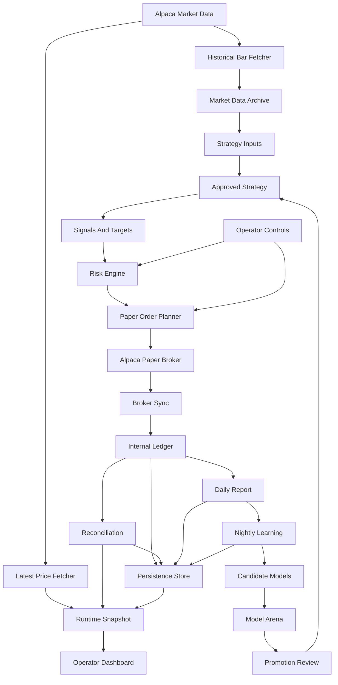

# Functional Trading App Completion Spec

Last updated: 2026-05-30

## Purpose

This document defines what is still required to turn the current trading research platform into a functional, always-on paper-trading app with real U.S. market data, fake money, visible model behavior, daily learning, operator safety controls, and a polished product experience.

The current project has a strong foundation. It has schemas, an internal ledger, historical data, backtesting, paper broker abstractions, risk controls, reporting, learning scaffolding, runtime persistence, operator controls, health checks, preflight checks, and a paper-runtime dry run.

The next objective is to prove the full system end to end with Alpaca paper credentials, real U.S. stock and ETF prices, reliable dashboard state, and repeatable operator procedures.

This document is not a live-trading authorization plan. The app remains paper-first and research-first.

## Non-Negotiable Boundaries

- Trade scope remains U.S.-listed stocks and U.S.-listed ETFs only.
- No non-U.S. markets.
- No crypto.
- No forex.
- No futures.
- No options.
- No margin.
- No short selling.
- No real-money trading path should be reachable from the normal app.
- Alpaca integration remains paper-only until a separate live-readiness process explicitly approves otherwise.
- The runtime may monitor continuously, but strategy execution remains schedule-bound.
- Intraday price refresh is for monitoring, valuation, risk, and operator visibility, not high-frequency trading.
- AI may research, explain, summarize, compare, audit, and recommend. AI must not silently promote models or directly control live execution.

## Current Progress Assessment

### Strong Foundations Already Built

- Strict Pydantic schemas for core trading objects.
- Internal fake-money ledger with orders, fills, positions, cash, realized P&L, and cost handling.
- Daily historical market data layer with fixtures, Alpaca support, Parquet storage, and DuckDB queries.
- Strategy research layer with monthly sector momentum plus research-only trend following, mean reversion, volatility-aware allocation, benchmark-relative strength, defensive regime switching, and cash rotation.
- Backtest runner with benchmark comparison, costs, slippage, and tax-bucket scaffolding.
- Paper tax-lot estimates with explicit FIFO, LIFO, or HIFO lot-method assumptions.
- Broker statement snapshot capture, local JSON/CSV statement import,
  reconciliation report writing, and paper tax-lot CSV export for post-run review.
- Statement reconciliation now records the raw saved statement source file and
  its SHA-256 fingerprint; the artifact-integrity manifest must confirm the
  saved source file still matches that reconciliation-time fingerprint before
  signoff.
- Paper broker abstractions and Alpaca paper broker integration.
- Risk engine foundation.
- Daily reporting foundation.
- Nightly learning scaffolding.
- Model arena and promotion workflow scaffolding.
- Dashboard state, local dashboard server, live-refreshing operator panels, broker/model proof fields, active-model explanation panel, data-quality evidence panel, and visual smoke checks.
- Persisted dashboard visual-readiness audit that inspects the rendered cockpit
  for paper boundary, runtime surfaces, operator controls, alerts, data quality,
  active model explanation, live-readiness gating, responsive structure, and
  financial visuals.
- Daily reports with active-model dossier, trade explanations, audit trail, data-quality evidence, and AI governance summary.
- Always-on Alpaca paper runtime architecture.
- Runtime persistence and recovery.
- Operator controls and alerts.
- Runtime health and incident command.
- Startup preflight.
- Credentialed dry-run workflow, operator runbook, local operations profile,
  supervisor templates, operations-readiness audit, and operator evidence bundle.
- Runtime validation reports now persist a credentialed paper validation
  checklist covering preflight, monitor-only dry run, scheduled-order dry run,
  latest-price freshness, broker sync, dashboard snapshot, soak evidence,
  paper-order boundary, report generation, nightly learning, and provenance.
- The validation checklist keeps partial soak evidence separate from the
  stricter full-day plus overnight requirement, so one or more short soak cycles
  cannot masquerade as a completed 24-hour proof.
- Completion, evidence-bundle, and signoff gates now reject legacy validation
  reports that omit the credentialed paper checklist, even if those reports
  otherwise claim a passed status.
- Normal shutdown and emergency-stop procedures are documented in the operator
  runbook and checked by the operations-readiness audit.
- Persisted lifecycle drill audit that proves startup evidence exists, operator
  controls were exercised, emergency-stop controls were tested, and shutdown
  procedures are documented before signoff.
- Persisted credentialed-session proof that ties preflight, validation, runtime
  snapshot, dashboard snapshot, latest-price provenance, full-day soak, broker
  statement reconciliation, broker order-history, and secret scan evidence to
  one Alpaca paper session without storing credential values.
- Credentialed-session coverage now requires its Markdown proof artifact to
  still exist on disk before downstream evidence can treat the proof as clean.
- Runtime startup now fails closed if an older script tries to skip preflight or
  start without the required monitor-only dry run.
- The Alpaca paper broker factory rejects live-trading environment flags before
  creating any broker client, even if code bypasses the CLI preflight path.
- Preflight and the Alpaca paper broker factory also reject live Alpaca endpoint
  overrides such as `APCA_API_BASE_URL=https://api.alpaca.markets`; paper
  endpoint overrides remain allowed, and quoted env-style values are normalized
  before evaluation.
- Alpaca credential checks now require non-blank trimmed API key and secret
  values across preflight, market-data clients, broker clients, and paper
  session construction.
- Startup-facing runtime and market-data CLIs now preserve operator-supplied
  symbol casing and reject lowercase or otherwise invalid ticker inputs through
  the normal symbol-scope checks instead of silently normalizing them.
- Operations readiness now validates active `.env` template assignments, not
  just placeholder text snippets, so appended real credential values or exported
  live endpoint overrides make the env template unsafe.
- Dependency installation is documented for Python 3.12+ with `uv` and checked
  by operations readiness.
- One-command post-run review that chains soak analysis, statement
  reconciliation, secret scanning, operations-readiness auditing, restart
  recovery auditing, model-governance auditing, credentialed-session proof,
  evidence coherence, artifact integrity, completion audit, and evidence
  bundling.
- Manual operator signoff artifact that records reviewed paper evidence,
  Alpaca paper account history confirmation, no-unintended-order confirmation,
  dashboard review, fill/reconciliation review, paper-only boundary review, and
  known data/tax limitations.
- Operator signoff now fails cleanly when the reviewer name or paper account
  identifier is blank, preserving a reviewable failed report instead of raising
  a validation exception.
- Artifact integrity now fingerprints the final evidence bundle state and
  Markdown report before operator signoff, so the reviewed bundle is part of the
  hashed review packet.
- Artifact-integrity coverage now rechecks current required artifact files
  against the manifest and rejects missing files or SHA-256 drift after the
  manifest was written.
- Operator signoff rejects stale integrity manifests generated before the
  evidence bundle they are supposed to cover, and it rejects reviewed artifacts
  that no longer match the final integrity manifest hashes or are dated after
  the attempted signoff.
- Operator signoff also verifies the reviewed Markdown reports for completion
  audit, evidence bundle, artifact integrity, and credentialed-session proof
  still match their persisted state before the human signoff is accepted.
- Final acceptance now runs after operator signoff and verifies the signed
  packet itself: signoff, required confirmations, reviewed artifact paths,
  completion audit, evidence bundle, artifact integrity, credentialed-session
  proof, current hashes for reviewed artifacts, paper-account alignment, packet
  ordering across the completion audit, credentialed-session proof, evidence
  bundle, artifact integrity, signoff, and acceptance timestamp, alignment
  between signed paths and latest persisted evidence paths, and paper-only
  limitation acknowledgements.
- Final acceptance also rejects partial operator-signoff artifacts that omit any
  required named signoff check, even if the signoff still claims an accepted
  status.
- Operator-signoff and final-acceptance coverage now reject signed review paths
  that are present in the report but whose files no longer exist.
- Final acceptance verifies the persisted operator-signoff state and Markdown
  artifact still agree, so a stale or overwritten signoff file cannot be treated
  as a current signed packet.
- Final acceptance verifies the signed review Markdown for the completion
  audit, evidence bundle, artifact-integrity manifest, and credentialed-session
  proof still matches the persisted state used for acceptance.
- Dashboard consistency now rejects incomplete persisted final-acceptance
  reports, so the cockpit cannot show a partial final-acceptance artifact as
  functionally complete.
- Dashboard consistency now also rejects final-acceptance evidence whose
  Markdown report is missing or no longer matches the persisted acceptance
  state.
- Dashboard consistency now rejects evidence-bundle reports whose Markdown
  artifact is missing or no longer matches the persisted bundle state.
- Dashboard consistency now rejects artifact-integrity and credentialed-session
  reports whose Markdown artifacts are missing or no longer match persisted
  review state.
- Dashboard consistency now rejects completion-audit evidence whose Markdown
  report is missing or no longer matches the persisted completion state.
- Dashboard consistency now rejects partial persisted completion-audit reports
  that omit any required functional requirement, even if the report still claims
  a passed status.
- Functional-completion coverage now also rejects completion-audit reports whose
  Markdown dossier path is missing or whose dossier file no longer exists.
- Standalone final-review audit coverage now also rejects missing Markdown
  review artifacts for guardrails, fills, recovery, operations, lifecycle,
  dashboards, data quality, broker order history, model governance, evidence
  coherence, evidence bundle, artifact integrity, credentialed-session proof,
  completion audit, and final acceptance.
- Full-day soak evidence now checks that every persisted runtime cycle refreshed
  latest prices and synced broker state.
- Full-day soak evidence separates warning and error runtime events; error
  events block functional completion until reviewed through a clean rerun.
- Dashboard consistency proof now checks that persisted runtime and dashboard
  snapshots are fresh relative to the audit time, not merely internally matching.
- Dashboard consistency proof now verifies operator controls, runtime alerts,
  and health state match the persisted runtime snapshot.
- Functional completion rejects dashboard snapshots that still contain obvious
  demo, fixture, or mock provenance even if the dashboard has been relabeled as
  `Alpaca Paper`.
- Post-run review preserves warning-status soak evidence instead of flattening
  it into a clean passed step.
- Functional completion now requires a persisted order-guardrail audit proving
  stale or missing prices, risk rejection, dirty reconciliation, paper kill
  switch, and operator pause all block paper orders.
- Functional completion now requires a persisted schedule-guardrail audit proving
  strategy authority stays daily-close only: regular-hours monitoring, pre-trade
  windows, same-day repeats, and weekends cannot submit paper orders.
- Functional completion now requires a persisted fill-sync audit proving broker
  fill deltas apply to the internal ledger exactly once across partial fills,
  repeat syncs, second partial fills, and restart recovery.
- Functional completion now requires a persisted data-quality audit proving fresh
  SIP data passes, IEX/free data is labeled development-grade, and stale,
  missing, duplicate, mixed-feed, and lookahead data are caught before trust.
- Functional completion and evidence bundling reject partial guardrail,
  validation-checklist, fill-sync, data-quality, restart-recovery,
  broker order-history, operations, lifecycle, credentialed-session, dashboard,
  and model-governance audit
  artifacts that do not include every required named scenario and minimum or
  matching count.
- Evidence bundling now rejects any passed required item that does not provide
  a reviewable local artifact path or whose artifact path no longer exists.
- Evidence-bundle coverage also rejects self-referential item paths that point
  back to the bundle's own Markdown report instead of the underlying reviewed
  artifact.
- Operator signoff rejects partial final-review packets, including incomplete
  evidence bundles, completion audits, credentialed-session proof, and artifact
  integrity manifests, even when those artifacts claim a passed status.
- Functional completion now requires broker order-history evidence proving
  Alpaca paper broker orders match persisted local order submissions and fills.
- Broker order-history capture can now be scoped to the reviewed paper-session
  window and symbol universe, which prevents older unrelated Alpaca paper orders
  from contaminating functional proof.
- Functional completion now requires credentialed-session proof before marking
  Alpaca paper startup evidence proven.
- Secret scanning can include exported dashboard HTML and local log paths in
  addition to the runtime artifact directory, without rendering secret values.
- Secret scanning normalizes quoted or whitespace-padded Alpaca credential
  values before matching so it scans for the actual credential string.
- Post-run review now automatically includes the raw saved broker statement
  source in the credential-leak scan, even if that source file is outside the
  runtime artifact directory.
- The one-command post-run review can pass those extra dashboard/log paths into
  the persisted secret-scan evidence.
- Functional completion and credentialed-session proof now require the secret
  scan to have checked both `ALPACA_API_KEY` and `ALPACA_SECRET_KEY`; a scan
  run without the credential values is not enough to prove no leak.
- Functional completion rejects obvious fixture-only/provided-only provenance
  markers such as fixture validation IDs, fixture statement sources, or injected
  broker order-history reports.
- Functional completion now requires nightly learning evidence to prove the
  learning run happened after the daily report, stayed recommendation-only, and
  kept every recommendation manual-review gated.
- Functional completion now requires the daily report to be a real persisted
  Markdown artifact with matching metadata/path evidence and an after-close
  generation timestamp.

### Still Missing For A Functional App

- A proven credentialed Alpaca paper session against real market data.
- Credentialed proof that the live-updating dashboard remains accurate during a real Alpaca paper runtime session, including a clean persisted dashboard-consistency audit.
- A supervised runtime process installed and exercised under the local startup/shutdown story.
- Real-world validation of order submission, fill ingestion, reconciliation, and
  restart recovery against a credentialed Alpaca paper session.
- Credentialed broker order-history comparison against persisted local paper
  order and fill journals.
- A real, non-fixture credentialed-session proof artifact generated from a
  supervised Alpaca paper session.
- Continued maturation of the model research workflow, including deeper walk-forward/regime evidence and paper-session comparison.
- Credentialed validation that data-quality checks catch stale, missing, or development-grade real Alpaca data before trusting paper-trading conclusions.
- Real-world post-trade review after a credentialed Alpaca paper session.
- A product-grade UI that matches the project's design ambition.
- Deployment and operating procedures for keeping the app alive 24 hours.
- Credentialed broker statement review still needs real-world treatment, and
  filing-grade tax limitations remain explicit.
- A staged path toward eventual limited real-money readiness, without enabling it prematurely.

## Definition Of A Functional App

The app should be considered functionally usable for the current paper-trading phase only when all of the following are true:

1. An operator can start the app with Alpaca paper credentials using a documented process.
2. The app performs offline preflight before runtime startup.
3. The app can run a credentialed dry run without placing paper orders by default.
4. The app can run continuously for at least one full market day and one overnight period.
   Full-day proof must pass an evidence-coherence audit showing validation,
   soak, runtime, dashboard, broker order-history, and statement artifacts
   belong to the same reviewed paper-session window.
5. The dashboard shows real runtime state, not static demo state.
   The persisted dashboard snapshot must pass a dashboard-consistency audit
   against the latest runtime snapshot, and the rendered dashboard shell must
   pass a dashboard visual-readiness audit.
6. Latest prices refresh on schedule and show freshness.
   Functional proof requires a persisted data-quality audit showing fresh,
   stale, missing, and development-grade latest-price scenarios behave as
   expected.
7. Broker connection, cash, positions, orders, fills, and reconciliation are visible.
   Broker proof must identify the underlying provider as `alpaca-paper`; local
   fixture or in-memory broker evidence is useful for testing but not sufficient
   for functional proof. Functional proof also requires broker order-history
   audit evidence matching Alpaca paper orders to local submissions and fills.
8. Strategy evaluation occurs only on the approved daily-close schedule.
9. Paper orders are blocked when data is stale, risk rejects, reconciliation is dirty, or controls block execution.
10. Fills update the internal ledger exactly once.
    Functional proof requires a persisted fill-sync audit showing first partial
    fills, repeat syncs, second incremental fills, and restarted syncs do not
    create missing or duplicate ledger fills.
11. Restart recovery rebuilds internal state without duplicate orders or duplicate fills.
    Functional proof requires a persisted restart-recovery audit showing raw
    order/fill journals parse cleanly, rehydrate correctly, and align with the
    latest runtime paper snapshot.
12. A daily report is written after market close.
13. Nightly learning runs after reporting in recommendation-only mode.
14. The active model does not change without explicit approval.
    Functional proof requires a model-governance audit showing nightly learning
    remained advisory, active keys stayed unchanged, recommendations require
    manual review, and no model gained authority without approval evidence.
15. Alerts and operator controls are visible and actionable.
    Functional proof requires dashboard visual-readiness evidence showing
    rendered operator controls, alerts, incidents, and degraded-state styling.
16. The app clearly labels IEX/free data as development-grade.
    Functional proof requires the persisted data-quality audit to include IEX
    development-grade warning scenarios for latest prices and daily bars.
17. The app never creates a path to real-money trading during this phase.
18. A saved broker statement can be reconciled against the persisted paper
    ledger, with the saved statement source file fingerprinted and mismatches
    reviewed before calling the app functional.
19. A final post-signoff acceptance report passes after manual operator signoff
    and confirms the reviewed evidence packet is complete, ordered, and
    paper-only.

Post-run review should also fingerprint reviewed evidence artifacts with a
local integrity manifest before operator review. The final integrity manifest
used for signoff should include the persisted evidence bundle state and
Markdown report, and must be generated at or after that evidence bundle.

After operator review, a persisted operator signoff should record the reviewer,
paper account identifier, required confirmations, reviewed evidence paths, and
paper-only limitation acknowledgements. The signoff paper account identifier
must match the latest passed credentialed-session proof, and the reviewed
artifacts must still match the final integrity manifest at signoff time. The
signoff timestamp must be at or after the reviewed evidence timestamps.

After signoff, a final acceptance audit should be run and persisted. This gate
is intentionally post-signoff: it proves the signed packet is complete, the
reviewed files still exist and still match the final integrity manifest, the
completion/evidence/integrity/credentialed coverage remains clean, the signoff
paper account matches credentialed-session proof, the signoff contains every
required named signoff check, the signoff state and Markdown artifact still
match, the signoff happened after the completion audit, credentialed-session
proof, evidence bundle, and final integrity manifest, the signed paths still
match the latest persisted evidence paths, the signed review Markdown artifacts
still match persisted state, and final acceptance happened after signoff.

## Target Product Shape

The app should feel like a future-facing trading cockpit:

- simple enough to understand at a glance
- serious enough to trust with financial decisions later
- visually beautiful without becoming flashy or reckless
- transparent about risk, uncertainty, data quality, and model behavior
- transparent about whether final post-signoff acceptance has passed
- designed for a non-technical operator

The dashboard should not feel like a generic admin panel. It should feel like a calm, luminous, intelligent command center.

## System Architecture Target

## Implementation Spec 1: Credentialed Paper Validation

### Goal

Prove that the current runtime can operate against real Alpaca paper credentials and real market data without placing unintended orders.

### Requirements

- Run offline preflight before runtime startup.
- Run monitor-only dry run before any scheduled-order run.
- Require `ALPACA_API_KEY` and `ALPACA_SECRET_KEY`.
- Treat blank or whitespace-only credential values as missing.
- Never persist or render credential values.
- Confirm the runtime is using paper broker mode.
- Confirm the feed is either `IEX` or `SIP`.
- Warn clearly when using `IEX`.
- Confirm latest prices can be fetched for the configured universe.
- Confirm broker account, orders, and positions can be synced.
- Confirm validation evidence records the observed broker provider and latest
  price source/feed without exposing credentials.
- Confirm runtime snapshot serialization works.
- Confirm dashboard state can be produced from the runtime snapshot.
- Confirm local persistence writes preflight, dry-run, health, cycle, alert, and snapshot evidence.

### Acceptance Criteria

- The operator can run preflight successfully with valid paper credentials.
- The operator can run monitor-only dry run with zero submitted paper orders.
- Missing credentials fail fast.
- Blank or whitespace-only credential values fail fast.
- Live-trading flags fail fast.
- Public dashboard bindings fail fast.
- Credential values are not present in generated artifacts.
- Dry-run evidence is available under local ignored runtime data.

### Verification

- Unit tests for preflight and dry-run behavior.
- Manual credentialed dry run.
- Manual review of persisted artifacts.
- Manual confirmation that no paper order was submitted during monitor-only dry run.

## Implementation Spec 2: Full-Day Paper Runtime Soak

### Goal

Prove that the app can stay alive across a full U.S. market day and overnight period.

### Requirements

- Runtime must start from the documented operator command.
- Runtime must recover previous state before evaluating new trades.
- Runtime must refresh prices every 60 seconds during regular market hours.
- Runtime must refresh prices every 15 minutes outside regular market hours.
- Runtime must sync broker orders and positions on the same schedule.
- Runtime must continue overnight for health checks, reports, learning, and dashboard status.
- Runtime must handle transient market data and broker errors without crashing.
- Runtime must persist every cycle summary.
- Runtime must keep recent events available to the dashboard.
- Runtime must produce a clear final health state after a 24-hour period.

### Acceptance Criteria

- The app runs for at least one full market day plus one overnight period.
- The process does not require manual restarts.
- Any transient failures are captured as runtime events.
- Dashboard state remains available throughout the run.
- No paper order is submitted outside the allowed daily-close window.
- Daily report runs after close.
- Nightly learning runs after the report.

### Verification

- One supervised 24-hour Alpaca paper run.
- Review runtime health report.
- Review daily report.
- Review learning report.
- Review persisted cycle journal.
- Review broker paper account order history.

## Implementation Spec 3: Dashboard Productization

### Goal

Turn the dashboard from a proof of state into a product-grade operator cockpit.

### Requirements

- Serve dashboard from a local app server.
- Dashboard must consume live runtime snapshots from the backend.
- Dashboard must show runtime mode: `Alpaca Paper`.
- Dashboard must show paper/live boundary prominently.
- Dashboard must show latest price freshness.
- Dashboard must show market-data quality status, research/trading usability, provenance, and top quality issues.
- Dashboard must show broker connection state.
- Dashboard must show cash, positions, open orders, recent fills, and daily P&L.
- Dashboard must show active strategy/model.
- Dashboard must show risk state.
- Dashboard must show reconciliation state.
- Dashboard must show alerts and degraded conditions.
- Dashboard must show operator controls:
  - pause runtime
  - resume runtime
  - enable paper kill switch
  - disable paper kill switch
  - force reconciliation
  - generate report
- Dashboard must show report status and nightly learning status.
- Dashboard must show live-readiness as disabled and gated.
- Dashboard must be responsive across desktop and mobile.
- Dashboard must avoid technical jargon where possible.

### Visual Requirements

- Dark graphite base.
- Neon green for positive/active state.
- Electric cyan for intelligence/system state.
- Amber for caution.
- Red for danger.
- Off-white and cool gray for text.
- No casino-like celebration patterns.
- No large decorative blobs or generic SaaS styling.
- Dense but readable information layout.
- Financial numbers aligned and easy to scan.
- Degraded states visually obvious.

### Acceptance Criteria

- A non-technical operator can understand whether the system is safe, running, blocked, paused, or degraded within 10 seconds.
- The user can see whether the app is paper-only without searching.
- The user can see what the active model is doing and why.
- The user can see whether current market data is usable for research and paper trading.
- The dashboard renders correctly on desktop and mobile.
- Dashboard state comes from live runtime data, not demo data.
- Persisted dashboard visual-readiness audit passes for the rendered cockpit.

### Verification

- Browser-based visual check.
- `python -m trading_app.runtime.dashboard_visual --output-dir data/runtime`.
- Runtime snapshot API tests.
- Dashboard rendering tests.
- Manual mobile and desktop screenshot review.
- Control API tests.

## Implementation Spec 4: Broker Reconciliation And Fill Integrity

### Goal

Make internal accounting trustworthy when compared with Alpaca paper broker state.

### Requirements

- Poll Alpaca paper orders and positions.
- Detect filled and partially filled orders.
- Create internal fills only for incremental filled quantity.
- Never duplicate fills after restart.
- Compare internal positions to broker paper positions.
- Compare internal cash to broker paper cash when available.
- Capture reconciliation differences without overwriting internal ledger silently.
- Block new paper orders if reconciliation is not clean.
- Surface reconciliation status in dashboard and daily reports.

### Acceptance Criteria

- Partial fills are applied once.
- Full fills are applied once.
- Restart does not duplicate fills.
- Unknown broker fills produce a visible reconciliation issue.
- Internal-vs-broker mismatches block new paper orders.
- Operator can force reconciliation from dashboard.

### Verification

- Mocked Alpaca order lifecycle tests.
- Restart recovery tests and restart-recovery audit.
- Reconciliation mismatch tests.
- Manual paper-order smoke test.

## Implementation Spec 5: Strategy And Model Research Layer

### Goal

Move from one starter strategy to a disciplined model research system.

### Requirements

- Keep active paper trading strategy versioned and stable.
- Treat every strategy as a hypothesis.
- Require every strategy to define:
  - universe
  - benchmark
  - data requirements
  - trading cadence
  - holding period
  - signal logic
  - sizing logic
  - exit logic
  - risk assumptions
  - known failure modes
- Add multiple candidate strategy families over time:
  - sector ETF momentum
  - trend following
  - mean reversion
  - volatility-aware allocation
  - benchmark-relative strength
  - defensive regime switching
  - cash rotation model
  - fundamentals-informed model
  - AI-assisted event classification model
- Candidate strategies must run in research or shadow mode before promotion.
- Nightly learning may train, compare, summarize, and recommend.
- Nightly learning must not change the active paper model automatically.
- Model promotion must require evidence and explicit approval.

### Acceptance Criteria

- Every model has a strategy card or registry record.
- Every model has reproducible backtest evidence.
- Every active model has a clear active version.
- Candidate models can be compared against the active model and SPY.
- Promotion recommendations include risk, drawdown, turnover, cost, and data caveats.

### Verification

- Model registry tests.
- Backtest reproducibility tests.
- Candidate comparison tests.
- Promotion gate tests.
- Report review.

## Implementation Spec 6: Data Quality And Provenance

### Goal

Ensure model results are based on trustworthy, timestamp-safe data.

### Requirements

- Track source, feed, timeframe, adjustment status, and ingestion time for market data.
- Detect missing bars.
- Detect duplicate bars.
- Detect stale latest prices.
- Detect out-of-order records.
- Completion evidence must include the full deterministic latest-price and
  daily-bar scenario set plus explicit symbol-universe validation, not only a
  generic passed status.
- Distinguish IEX, SIP, fixture, and other sources.
- Label IEX/free data as development-grade.
- Validate symbol universe before fetching or trading.
- Keep adjusted and unadjusted data usage explicit.
- Prevent lookahead bias in strategies and backtests.
- Store enough provenance to reproduce model results.

### Acceptance Criteria

- Strategy runs fail or degrade when required data is missing.
- Backtest reports include data source and feed caveats.
- Latest-price freshness is visible in dashboard.
- Market-data quality status and provenance are visible in dashboard.
- Reports can identify which feed and dataset produced a result.
- Tests prove strategies do not rank using future data.

### Verification

- Data quality unit tests.
- Fixture tests with missing and stale data.
- Strategy lookahead tests.
- Report provenance tests.

## Implementation Spec 7: Accounting, Fees, Slippage, And Taxes

### Goal

Make performance reporting realistic enough for decision-making, while clearly separating estimates from tax-grade accounting.

### Requirements

- Continue using `Decimal` for all money and quantity values.
- Model buy cash impact as price times quantity plus commission.
- Model sell cash impact as price times quantity minus commission and sell fees.
- Include slippage assumptions in backtests.
- Include commissions, sell fees, and spread assumptions in reports.
- Track realized gains by short-term and long-term holding period buckets.
- Track tax lots well enough for estimated research reporting.
- Mark after-tax return unavailable unless explicit tax rates are provided.
- Clearly state that tax reporting is an estimate, not filing-grade accounting.

### Future Requirements

- Broker-native statement import and broker election reconciliation.
- Wash-sale awareness.
- Dividend handling.
- State tax assumptions.
- Filing-grade accountant workflow beyond the current local statement import.
- Accountant-friendly export beyond paper research estimates.

### Acceptance Criteria

- Reports show gross, after-cost, and estimated after-tax when configured.
- Reports separate short-term and long-term realized gains.
- Backtests prove costs reduce net returns.
- Paper runtime reports include realized P&L and fees where available.
- UI clearly labels tax estimates as estimates.

### Verification

- Ledger accounting tests.
- Backtest cost tests.
- Tax bucket tests.
- Report rendering tests.

## Implementation Spec 8: Reporting, Explainability, And Audit Trail

### Goal

Make the system understandable after every trading day.

### Requirements

- Write daily markdown report after market close.
- Include portfolio state.
- Include orders and fills.
- Include realized P&L.
- Include risk decisions and rejections.
- Include reconciliation status.
- Include data quality warnings.
- Include active model status.
- Include model signals and rationale.
- Include benchmark comparison when possible.
- Include learning recommendations.
- Include operator actions.
- Persist report metadata and path.
- Make reports visible in the dashboard.

### Acceptance Criteria

- An operator can answer: what happened today, why, and whether anything is wrong.
- Every trade has a model, signal, risk decision, order, fill, and ledger trace.
- Every blocked trade has a visible reason.
- Reports are reproducible from persisted state.

### Verification

- Daily report tests.
- Runtime report integration tests.
- Manual report review after paper run.

## Implementation Spec 9: Operator Safety And Incident Response

### Goal

Make the app operable by a human without needing to inspect code or logs first.

### Requirements

- Operator dashboard must expose:
  - paused state
  - paper kill switch
  - stale data
  - broker degraded state
  - reconciliation status
  - recent runtime errors
  - latest successful report
  - latest successful learning run
- Operator controls must be local-only by default.
- Controls must be persisted.
- Alerts must persist and survive restart.
- Incidents must be visible and reviewable.
- Restart procedure must be documented.
- Emergency stop procedure must be documented.

### Acceptance Criteria

- Operator can pause trading without stopping monitoring.
- Operator can enable paper kill switch.
- Operator can force reconciliation.
- Operator can generate report.
- Runtime remains paper-only after controls are used.
- All control actions are recorded.

### Verification

- Operator control tests.
- Alert tests.
- Persistence tests.
- Manual runbook exercise.

## Implementation Spec 10: Deployment And Always-On Operation

### Goal

Make it practical to run the app continuously on a local machine or small server.

### Requirements

- Provide one documented startup path.
- Provide one documented shutdown path.
- Provide environment variable template.
- Provide local-only dashboard binding by default.
- Provide data directory layout.
- Provide log and runtime artifact locations.
- Provide restart recovery procedure.
- Provide dependency installation procedure.
- Provide process supervision recommendation.
- Avoid requiring manual command chaining.
- Provide a persisted operations-readiness audit for startup posture, local
  dashboard binding, ignored artifact layout, env template safety, runbook
  coverage, and supervisor template safety.

### Suggested Local Runtime Model

- Local Python runtime for the backend.
- Local dashboard server bound to `127.0.0.1`.
- Local ignored `data/runtime/` folder for runtime artifacts.
- `.env` or shell-exported credentials outside git.
- Optional process supervisor later:
  - `launchd` on macOS
  - `systemd` on Linux
  - containerized process after the local runtime is stable

### Acceptance Criteria

- Operator can start the app from clean instructions.
- App writes all runtime data under ignored local folders.
- App can restart without losing internal paper state.
- Dashboard stays available while runtime is active.

### Verification

- Fresh machine setup rehearsal.
- Operations-readiness audit.
- Restart test.
- 24-hour soak test.
- Artifact review.

## Implementation Spec 11: Security And Credentials

### Goal

Prevent accidental credential leakage or accidental live-money use.

### Requirements

- Credentials must come from environment variables or local secret storage.
- Credentials must never be written to logs, reports, snapshots, dashboard HTML, or test output.
- Runtime must fail fast if credentials are missing when required.
- Runtime must fail fast if live-trading flags are enabled.
- Runtime must fail fast if Alpaca endpoint overrides point at live endpoints.
- Dashboard controls must bind locally by default.
- Public network binding must fail preflight unless explicitly supported later with authentication.
- Do not store Alpaca account secrets in git.
- Redact secrets in all rendered reports.

### Acceptance Criteria

- Secret values do not appear in persisted artifacts.
- Secret values do not appear in explicitly reviewed dashboard HTML or log
  artifacts.
- Secret scan evidence checked both configured Alpaca credential values.
- Preflight catches missing credentials.
- Preflight catches live-mode flags.
- Dashboard does not expose controls publicly by default.

### Verification

- Secret redaction tests.
- Preflight tests.
- Manual artifact inspection.

## Implementation Spec 12: AI-Assisted Research And Governance

### Goal

Use AI to make the platform smarter without letting AI become an uncontrolled trader.

### AI May Do

- Summarize daily performance.
- Explain model behavior.
- Identify unusual trades.
- Propose candidate strategy changes.
- Compare model variants.
- Detect possible data quality problems.
- Draft model promotion memos.
- Classify news or events for later research.
- Generate human-readable incident summaries.

### AI Must Not Do Yet

- Place orders directly.
- Bypass risk engine.
- Change the active model automatically.
- Rewrite live strategy code during runtime.
- Promote a model after one strong result.
- Hide uncertainty or data caveats.

### Requirements

- AI outputs must be recorded as recommendations.
- AI recommendations must cite evidence from reports, backtests, or runtime data.
- AI confidence should be visible.
- AI recommendations must be reviewable before action.
- Active model changes must require explicit approval.
- Nightly learning must not automatically promote model state or trading
  authority.

### Acceptance Criteria

- Nightly learning produces a recommendation artifact.
- Recommendation artifact separates evidence, interpretation, and proposed action.
- Promotion workflow requires approval.
- Dashboard makes AI role clear: copilot, not trader.

### Verification

- Nightly learning tests.
- Recommendation rendering tests.
- Promotion gate tests.
- Model-governance audit.

## Implementation Spec 13: Live-Money Readiness Gate

### Goal

Define what must be true before even considering a limited real-money pilot.

This is intentionally not part of the current functional paper app. It is included to keep the boundary explicit.

### Required Before Real Money

- At least several months of stable paper trading evidence.
- Multiple market regimes observed or simulated.
- Clean reconciliation history.
- No unexplained duplicate fills or ledger errors.
- Reliable dashboard and operator controls.
- Strong data quality reports.
- Realistic cost, slippage, and tax assumptions.
- Model performance robust after fees and estimated taxes.
- Drawdown behavior within documented limits.
- Manual approval workflow.
- External review of risks.
- Explicit funding limits.
- Broker account permission review.
- Emergency shutdown procedure tested.

### Not Acceptable

- Funding a model because of one strong backtest.
- Funding a model because of one strong paper-trading week.
- Funding a model with unclear trade rationale.
- Funding a model with dirty reconciliation.
- Funding a model that depends on IEX/free data without understanding limitations.
- Funding a model that cannot explain failures.

## Suggested Roadmap From Here

### Phase A: Prove The Paper Runtime

Objective: prove the current engine can safely run with Alpaca paper credentials.

Deliverables:

- Credentialed preflight.
- Monitor-only dry run.
- Scheduled-order dry run.
- One full market-day paper runtime run.
- One overnight runtime run.
- Operator review of artifacts.
- Operator evidence bundle generated after completion audit.
- One-command post-run review completed without failed evidence steps.
- Operations-readiness audit generated and passed for the reviewed session.
- Lifecycle drill audit generated and passed for the reviewed session.
- Credentialed-session proof generated and passed for the reviewed session.
- Restart-recovery audit generated and passed for the reviewed session.
- Model-governance audit generated and passed for the reviewed session.
- Dashboard visual-readiness audit generated and passed for the reviewed
  rendered cockpit.
- Operator signoff recorded after evidence-bundle review and direct Alpaca paper
  account-history review, with the signed paper account matching the
  credentialed-session proof.

Exit criteria:

- No unintended paper orders.
- No duplicate fills.
- Dashboard snapshot reflects real runtime state.
- Rendered dashboard exposes paper boundary, controls, alerts, data quality,
  active model, live-readiness gate, and responsive layout evidence.
- Operator signoff confirms the external Alpaca paper account history matched
  the local evidence.
- Daily report and nightly learning run complete.

### Phase B: Productize The Dashboard

Objective: make the app understandable and beautiful.

Deliverables:

- Live operator cockpit.
- Portfolio, orders, fills, risk, model, report, and learning panels.
- Persisted dashboard visual-readiness report and reviewable rendered HTML.
- Neon future-finance visual system.
- Responsive desktop and mobile layouts.
- Control buttons connected to backend state.

Exit criteria:

- User can operate the app without reading logs.
- Paper/live status is impossible to miss.
- Degraded states are obvious.
- Dashboard is visually strong enough to become the product face.

### Phase C: Strengthen Research And Model Comparison

Objective: make model development disciplined.

Deliverables:

- Model registry improvements.
- Strategy cards.
- Multiple candidate strategies.
- Walk-forward validation.
- Shadow-mode comparison.
- Promotion memos.
- Better benchmark and regime analysis.

Exit criteria:

- Active model can be compared against candidates.
- Candidate promotion requires evidence.
- Nightly learning produces useful recommendations without changing the active model.

### Phase D: Harden Data, Accounting, And Operations

Objective: increase trust in conclusions.

Deliverables:

- Data quality checks.
- Real-world broker statement reconciliation evidence.
- Broker-native statement export parsing.
- Restart and recovery rehearsals.
- Longer soak tests.
- Incident review workflow.

Exit criteria:

- Paper-trading history is auditable.
- Reports are trustworthy enough for model evaluation.
- Operators understand failure states and recovery paths.

### Phase E: Live Readiness Review Only

Objective: decide whether a limited live-money pilot should ever be considered.

Deliverables:

- Live-readiness dossier.
- Risk review.
- Strategy evidence packet.
- Funding limits.
- Manual approval workflow.
- Emergency stop rehearsal.

Exit criteria:

- A deliberate human decision, not an automatic system transition.

## Proposed Next External Milestone

The next external milestone should be:

## Credentialed Paper Runtime Validation And First Full-Day Soak

### Summary

Use real Alpaca paper credentials to validate the runtime end to end in paper-only mode. Run preflight, monitor-only dry run, scheduled-order dry run, then a supervised full-day plus overnight soak. Persist evidence and produce an operator validation report.

### Key Deliverables

- Credentialed paper validation checklist.
  The checklist must persist item-level status, message, and evidence, and it
  must explicitly distinguish soak-cycle evidence from completed full-day plus
  overnight proof.
- Runtime validation report model.
- CLI command for supervised validation sequence.
- Paper broker connectivity proof.
- Real latest-price freshness proof.
- Broker sync proof.
- Dashboard snapshot proof.
- Credentialed-session proof tying validation, soak, dashboard, statement, and
  order-history provenance to one Alpaca paper account.
- Report and learning proof.
- Full-day soak artifact summary.

### Explicit Non-Goals

- No new strategy complexity.
- No UI redesign yet.
- No real-money trading.
- No intraday trading.
- No automatic model promotion.

### Why This Should Be Next

The current foundation is broad enough. The highest-value next step is not adding more features. It is proving that the app can actually run with real paper-market conditions and produce truthful evidence.

The local product surface is now strong enough to support this validation, but it is not a substitute for real paper-session evidence.

## Product Readiness Scorecard

| Area | Current State | Needed For Functional App |
| --- | --- | --- |
| Core schemas | Strong | Continue tightening as features expand |
| Ledger | Strong for paper accounting | More tax-lot depth later |
| Historical data | Useful foundation | More data quality and provenance checks |
| Backtesting | Good first version with multiple research candidates | Walk-forward validation and deeper regime testing |
| Paper broker | Implemented | Real credentialed validation |
| Always-on runtime | Architected and locally tested | Full-day and overnight soak proof |
| Persistence | Implemented | Longer recovery testing |
| Operator controls | Implemented and dashboard-driven locally | Real paper-session exercise |
| Alerts and health | Implemented | Real-world tuning |
| Dashboard | Functional local cockpit with live-refreshing panels and model explanation | Credentialed runtime proof and deeper product polish |
| Learning loop | Scaffolded | Better candidate generation and review |
| AI governance | Grounded summaries and recommendation guardrails started | More evidence-based recommendation artifacts |
| Accounting/taxes | Explicit paper lot-method estimates, paper statement capture, local statement file reconciliation, Markdown reports, and CSV lot export | Credentialed broker statement review and filing-grade limitations |
| Security | Good local posture | Continued secret redaction and local binding |
| Final acceptance | Post-signoff acceptance gate implemented | Real signed Alpaca paper evidence packet |
| Live readiness | Intentionally gated | Months of paper evidence before review |

## Final Standard

The app is functional when it can be started, trusted, inspected, paused,
recovered, understood, signed by the operator, and verified by the final
post-signoff acceptance audit.

It is excellent when it also feels calm, intelligent, beautiful, and future-facing.

It is fundable only after paper evidence, risk discipline, and human review make that decision feel boring rather than exciting.
