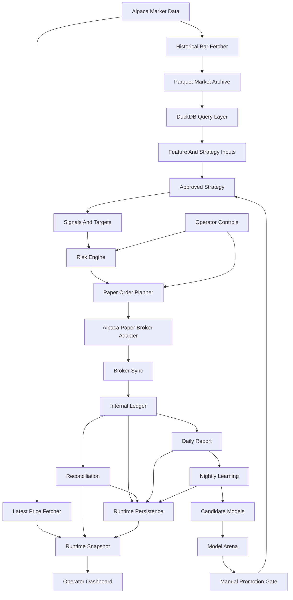

# Functional Trading App Implementation Spec

Last updated: 2026-05-30

## Purpose

This document is the implementation blueprint for turning the current trading
research platform into a functional, always-on Alpaca paper-trading app.

It consolidates the project vision, current architecture, safety boundaries,
product requirements, runtime requirements, evidence requirements, and remaining
implementation work into one source of truth.

The companion document `FUNCTIONAL_APP_COMPLETION_SPEC.md` defines the bar for
calling the paper app functional. This document explains how the system should
be built and operated to reach that bar.

## Product Thesis

The app is a disciplined U.S. stock and ETF research system that uses real
market data, fake money, explicit models, strong risk controls, and a beautiful
operator cockpit.

The system should be always on, but not always trading.

Always on means:

- refreshing market data
- monitoring Alpaca paper broker state
- updating runtime health
- reconciling internal and broker accounting
- keeping the dashboard current
- writing daily reports
- running nightly learning
- preserving evidence

Always trading is not acceptable. The approved trading loop should remain
schedule-bound, risk-gated, paper-only, and auditable.

The guiding phrase remains:

> Algorithms trade. AI researches, explains, audits, and improves.

## Non-Negotiable Boundaries

- Trade U.S.-listed stocks and U.S.-listed ETFs only.
- Do not trade non-U.S. markets.
- Do not trade crypto, forex, futures, options, CFDs, or unapproved synthetic
  products.
- Do not use margin.
- Do not short sell.
- Do not enable real-money trading in the normal runtime path.
- Do not let a strategy call broker APIs directly.
- Do not let AI place orders, bypass risk, or promote active models
  automatically.
- Do not trust IEX/free data for final model confidence without caveats.
- Do not call paper results tax-grade accounting.
- Do not call the app functional until credentialed Alpaca paper evidence has
  been reviewed.

## Current Implementation Map

The repo already has a substantial foundation:

| Area | Current modules |
| --- | --- |
| Core contracts | `src/trading_app/schemas.py` |
| Ledger | `src/trading_app/ledger.py` |
| Historical data | `src/trading_app/market_data/historical.py`, `storage.py`, `fetch_bars.py` |
| Latest prices | `src/trading_app/market_data/latest.py` |
| Data quality | `src/trading_app/market_data/quality.py` |
| Strategies | `src/trading_app/strategies/` |
| Backtests | `src/trading_app/backtest/` |
| Paper broker and service | `src/trading_app/broker/`, `src/trading_app/paper/` |
| Risk engine | `src/trading_app/risk/engine.py` |
| Daily reports | `src/trading_app/reporting/` |
| Learning and model governance | `src/trading_app/learning/` |
| Runtime | `src/trading_app/runtime/` |
| Dashboard | `src/trading_app/dashboard/`, `dashboard/operator-dashboard.html` |
| Live-readiness gate | `src/trading_app/live/readiness.py` |

Current supporting documents:

- `README.md`
- `GET_SMART_TRADING_STRATEGIES.md`
- `RECOMMENDED_STACK.md`
- `PROJECT_BACKBONE_RECOMMENDATION.md`
- `DESIGN_VISION.md`
- `PAPER_RUNTIME_OPERATOR_RUNBOOK.md`
- `LIVE_TRADING_READINESS_RUNBOOK.md`
- `FUNCTIONAL_APP_COMPLETION_SPEC.md`

## Functional Definition

The current paper app is functional only when an operator can:

1. Start the app with Alpaca paper credentials from documented instructions.
2. Run preflight before startup.
3. Run a monitor-only dry run that submits zero paper orders.
4. Run the runtime continuously for at least one full U.S. market day plus one
   overnight period.
5. See live runtime state in the dashboard.
6. Confirm price freshness, broker connection, cash, positions, open orders,
   fills, risk, reconciliation, reports, learning, and alerts from the UI.
7. Confirm strategy evaluation happens only on the approved daily-close
   schedule.
8. Confirm stale data, missing prices, dirty reconciliation, risk rejection,
   paper kill switch, and operator pause all block new paper orders.
9. Confirm broker fills update the internal ledger exactly once.
10. Confirm restart recovery does not duplicate orders or fills.
11. Confirm daily report generation happens after market close.
12. Confirm nightly learning happens after the daily report and remains
    recommendation-only.
13. Confirm active model authority cannot change without explicit approval.
14. Confirm runtime artifacts contain no credentials.
15. Confirm post-run review, completion audit, artifact integrity, and evidence
    bundle all pass or clearly identify missing external evidence.
16. Record manual operator signoff after reviewing the evidence bundle and
    Alpaca paper account history.
17. Run final post-signoff acceptance to verify the signed evidence packet is
    complete, ordered, paper-only, and aligned to the same Alpaca paper account.

## System Architecture



## Implementation Spec 1: Project Runtime Foundation

### Goal

Keep the codebase small enough to reason about while supporting real paper
runtime behavior.

### Requirements

- Use Python `>=3.12`.
- Use `uv` for dependency management.
- Keep package name `trading_app`.
- Keep source under `src/trading_app/`.
- Keep tests under `tests/`.
- Keep runtime artifacts under ignored `data/runtime/`.
- Keep market archives under ignored `data/market_data/`.
- Use `pydantic` v2 for strict contracts.
- Use `Decimal` for money and quantity.
- Use timezone-aware timestamps only.
- Use `ruff` and `pytest` as the standard verification tools.

### Acceptance Criteria

- `uv run pytest` passes.
- `uv run ruff check` passes.
- `uv run ruff format --check` passes.
- A fresh operator can install dependencies from the runbook.
- No code path requires downgrading to the system Python.

## Implementation Spec 2: Data Contracts

### Goal

Make every market, signal, order, fill, ledger, runtime, and report object
typed, validated, and serializable.

### Core Contracts

- `MarketEvent`
- `DailyBar`
- `LatestPriceRecord`
- `LatestPriceSnapshot`
- `Signal`
- `Order`
- `Fill`
- `Position`
- `PortfolioSnapshot`
- `ExperimentRecord`
- broker order, fill, position, portfolio, statement, and reconciliation models
- paper session, runtime event, runtime cycle, runtime snapshot, and audit models
- learning, registry, candidate, evaluation, and recommendation models

### Requirements

- Reject unexpected fields.
- Reject naive datetimes.
- Reject invalid symbols.
- Require uppercase symbols for internal contracts and operator-facing runtime
  inputs. Startup commands must not silently uppercase lowercase ticker input.
- Reject zero or negative prices and quantities where trading semantics require
  positive values.
- Reject negative commissions, sell fees, and volumes unless explicitly
  modeled as adjustments.
- Serialize cleanly to JSON-compatible data.
- Preserve source, feed, session, timestamp, and adjustment metadata.

### Acceptance Criteria

- Schema tests cover valid and invalid examples.
- Runtime artifacts can round-trip through persisted JSON.
- Dashboard snapshot serialization does not need access to live Python objects.

## Implementation Spec 3: Market Data

### Goal

Use real U.S. market prices safely and preserve enough provenance to reproduce
research and paper-trading decisions.

### Historical Data Requirements

- Fetch daily adjusted U.S. stock and ETF bars from Alpaca.
- Support deterministic fixture data for tests.
- Store historical bars as Parquet partitioned by feed, timeframe, and symbol.
- Query historical bars through DuckDB without loading full archives into
  memory.
- Preserve source, feed, timeframe, adjustment, trading date, and bar timestamp.

### Latest Price Requirements

- Fetch latest Alpaca stock trades for configured symbols.
- Return typed latest-price records.
- Mark stale, missing, or degraded prices.
- Block new paper orders when required symbols lack fresh prices.
- Label IEX/free data as development-grade.

### Data Quality Requirements

- Detect missing bars.
- Detect duplicate bars.
- Detect stale latest prices.
- Detect out-of-order records.
- Detect invalid prices and volumes.
- Distinguish fixture, IEX, SIP, and other feeds.
- Validate symbol universe inputs explicitly before fetching or trading.
- Expose data quality in reports and dashboard.
- Completion and evidence-bundle audits require the full deterministic
  latest-price, daily-bar, and symbol-universe scenario set; a partial `passed`
  report is not sufficient.

### Acceptance Criteria

- Strategies do not fabricate missing prices.
- Backtests and runtime reports include data provenance.
- Dashboard shows price freshness and data-quality caveats.
- IEX warning remains visible in development-grade runs.

## Implementation Spec 4: Strategy Research

### Goal

Treat every model as a testable hypothesis with explicit assumptions and
evidence.

### Active Strategy Default

- `MonthlySectorMomentumStrategy`
- Universe: sector ETFs plus `SPY` for benchmark context.
- Lookback: 126 trading days.
- Rebalance: monthly.
- Holdings: top 3 ETFs, equal weight.
- Execution authority: daily close only in paper runtime.

### Candidate Strategy Families

- sector ETF momentum
- trend following
- mean reversion
- volatility-aware allocation
- benchmark-relative strength
- defensive regime switching
- cash rotation
- fundamentals-informed research
- AI-assisted event classification research

### Strategy Contract

Each strategy should define:

- strategy id
- version
- hypothesis
- universe
- benchmark
- data requirements
- trading cadence
- holding period
- ranking or signal logic
- sizing logic
- exit logic
- risk assumptions
- known failure modes
- authority level

### Requirements

- Strategies emit signals, targets, or recommendations.
- Strategies do not submit orders.
- Strategies must be timestamp-safe.
- Strategies must avoid lookahead bias.
- Active paper models are versioned and stable.
- Candidate models run in research or shadow mode before promotion.

### Acceptance Criteria

- Every model has a registry record or strategy card.
- Every active model has reproducible evidence.
- Every candidate comparison includes return, drawdown, volatility, turnover,
  cost, tax caveats, and benchmark context.

## Implementation Spec 5: Backtesting And Replay

### Goal

Compare strategies honestly before paper or live consideration.

### Requirements

- Use the same strategy concepts as runtime where practical.
- Use the internal ledger for simulated accounting.
- Include slippage, commissions, sell fees, turnover, and tax-bucket estimates.
- Compare against SPY buy-and-hold.
- Report gross return, net return, annualized return, annualized volatility,
  maximum drawdown, trade count, turnover, average holding period, and benchmark
  comparison.
- Clearly mark IEX/free data as development-grade.
- Do not optimize from one lucky backtest.

### Acceptance Criteria

- Costs and slippage reduce net returns in tests.
- Missing data excludes symbols instead of inventing values.
- Lookahead tests prove ranking uses only prior available data.
- Backtest reports are reproducible from recorded inputs.

## Implementation Spec 6: Paper Trading Runtime

### Goal

Run continuously with Alpaca paper money, real U.S. market prices, and no
real-money path.

### Runtime Requirements

- CLI entry point: `python -m trading_app.runtime.run_alpaca_paper`.
- Require Alpaca paper credentials when real Alpaca runtime is selected.
- Reject startup attempts that skip preflight.
- Require the monitor-only dry run before supervised runtime startup.
- Validate configured symbols exactly as supplied; lowercase or invalid ticker
  inputs must fail startup checks instead of being auto-corrected.
- Fail fast if credentials are missing.
- Fail fast if live trading is enabled.
- Reject live-trading environment flags again inside the Alpaca paper broker
  factory so direct runtime construction still fails closed.
- Default broker provider: `alpaca-paper`.
- Default feed: `IEX`, labeled development-grade.
- Default timezone: `America/New_York`.
- Default paper universe: sector ETFs plus `SPY`.
- Default starting paper cash for local fixtures: `100000`.
- Refresh prices every 60 seconds during regular market hours.
- Refresh prices every 15 minutes outside regular market hours.
- Sync broker state on the same schedule.
- Continue overnight for reports, learning, health checks, and dashboard state.

### Trading Authority Requirements

- Monitor continuously.
- Evaluate strategy only on the approved daily-close schedule.
- Submit paper orders only after risk approval.
- Sell reductions/removals before buys.
- Block orders when prices are stale or missing.
- Block orders when reconciliation is dirty.
- Block orders when risk rejects.
- Block orders when paper kill switch is enabled.
- Block orders when operator pause is enabled.
- Never submit orders outside the approved schedule.

### Acceptance Criteria

- Monitor-only dry run submits zero paper orders.
- Scheduled-order test submits paper orders only when explicitly allowed.
- Full-day soak records market-hours, off-hours, and overnight cycles.
- Every persisted cycle shows latest-price refresh and broker-sync evidence.
- Dashboard remains current during the run.

## Implementation Spec 7: Risk And Order Planning

### Goal

Create a clear wall between model intent and broker execution.

### Requirements

- Strategies generate desired targets.
- Runtime converts targets into proposed orders.
- Risk engine approves or rejects proposed orders.
- Order planner respects cash, current positions, symbol allowlist, paper-only
  mode, no margin, and no shorts.
- Rebalance sells first, then buys.
- Order rejections preserve rule-level evidence.
- Runtime persists all orders, rejections, and operator-visible explanations.

### Minimum Risk Gates

- symbol is U.S.-listed stock or ETF within configured universe
- no short sale
- no margin
- sufficient cash
- max position size
- max portfolio concentration
- daily loss guard
- stale data guard
- reconciliation clean guard
- paper kill switch guard
- operator pause guard
- live-disabled guard

### Acceptance Criteria

- Rejected trades appear in reports and dashboard.
- Risk decisions are testable without Alpaca credentials.
- Paper orders cannot be created by bypassing the risk engine.

## Implementation Spec 8: Broker Sync, Fill Integrity, And Reconciliation

### Goal

Keep internal accounting trustworthy while reconciling against Alpaca paper
broker state.

### Requirements

- Poll Alpaca paper orders and positions.
- Detect filled and partially filled broker orders.
- Convert broker fill deltas into internal `Fill` records.
- Apply only incremental filled quantity.
- Never apply the same fill twice.
- Persist order and fill journals.
- Rehydrate journals on restart.
- Compare internal positions to broker positions.
- Compare internal cash to broker cash when available.
- Compare persisted local order submissions and fills to broker-reported paper
  order history.
- Scope broker order-history capture to the reviewed paper-session window and
  configured U.S. stock/ETF symbols so unrelated Alpaca paper orders do not
  pollute the evidence packet.
- Capture reconciliation mismatches without silently overwriting the ledger.
- Block new paper orders when reconciliation is dirty.
- Surface reconciliation state in dashboard and daily reports.

### Acceptance Criteria

- Partial fills are applied once.
- Repeat sync does not duplicate fills.
- Second partial fill applies only the incremental quantity.
- Restart recovery does not duplicate fills.
- Unknown broker orders or fills create visible reconciliation issues.
- Completion evidence includes a fill-sync proof, restart-recovery proof, and
  broker order-history proof before external signoff.

## Implementation Spec 9: Accounting, Fees, Slippage, And Taxes

### Goal

Make results realistic enough for decision-making while clearly separating
research estimates from tax-grade accounting.

### Requirements

- Use `Decimal` for money and quantity.
- Buy cash impact equals quantity times price plus commission.
- Sell cash impact equals quantity times price minus commission and sell fees.
- Include buy commissions in average cost.
- Reduce realized P&L by sell commissions and sell fees.
- Include slippage assumptions in backtests and strategy comparisons.
- Track tax lots well enough for estimated paper reporting.
- Bucket realized gains as short-term or long-term.
- Support explicit tax-rate inputs for estimated after-tax returns.
- Mark after-tax return unavailable when tax rates are not supplied.
- State clearly that tax reporting is estimated and not filing-grade.

### Future Requirements

- dividends
- splits beyond adjusted-price research handling
- wash-sale awareness
- broker-native tax forms
- state tax assumptions
- accountant-ready export workflow

### Acceptance Criteria

- Reports separate gross, after-cost, and estimated after-tax views.
- Paper reports show realized P&L and tax-bucket estimates.
- UI labels tax estimates as estimates.

## Implementation Spec 10: Persistence And Recovery

### Goal

Make runtime evidence durable enough to inspect, restart, and audit.

### Runtime Artifact Layout

Expected local ignored layout:

```text
data/runtime/
  state/
  journal/
  reports/
  dashboard/
  supervision/
```

### Persisted Evidence

- preflight report
- dry-run report
- validation report
- runtime cycle journal
- runtime event journal
- orders journal
- fills journal
- latest runtime snapshot
- dashboard snapshot
- dashboard visual-readiness report
- health report
- daily report metadata and Markdown path
- nightly learning report
- reconciliation report
- statement reconciliation report
- raw broker statement source file
- soak report
- operations-readiness report
- lifecycle drill report
- credentialed-session proof report
- restart-recovery report
- model-governance report
- order-guardrail report
- schedule-guardrail report
- fill-sync report
- data-quality audit report
- broker order-history report
- evidence-coherence report
- completion audit report
- artifact-integrity manifest
- evidence bundle report
- operator signoff report
- final acceptance report

### Requirements

- Recovery must parse raw order and fill journals.
- Recovery must rehydrate ledger state.
- Recovery must align with latest persisted runtime snapshot.
- Recovery must not duplicate broker submissions or fills.
- Integrity manifest must hash reviewed artifacts.
- Integrity manifest must hash the raw saved broker statement source used for
  statement reconciliation.
- Integrity manifest must compare the raw saved broker statement source against
  the SHA-256 fingerprint recorded at reconciliation time and fail if it has
  changed.
- Artifact-integrity coverage must recheck current required artifact files
  against the recorded manifest and fail if any required file is missing or no
  longer matches its recorded SHA-256.
- The final integrity manifest used at signoff must hash the persisted
  evidence-bundle state and Markdown report, and it must be generated at or
  after the evidence bundle.
- Evidence bundle must point to the artifacts an operator reviewed.
- Evidence bundle must fail any passed required item whose review artifact path
  is missing or no longer exists.
- Evidence bundle must fail self-referential item paths that point back to the
  evidence bundle Markdown instead of the underlying artifact.
- Standalone review-audit coverage must require the persisted Markdown report
  path to be present and the referenced report file to still exist before that
  audit can support completion, bundling, signoff, or final acceptance.
- Operator signoff must record the reviewed evidence paths, paper account id,
  reviewer, confirmations, and paper-only limitations.
- Operator signoff must fail as a normal report, not crash, when reviewer or
  paper account id is blank.
- Operator signoff must fail if the supplied paper account id does not match
  the latest passed credentialed-session proof.
- Operator signoff must re-hash the reviewed artifacts listed in the final
  integrity manifest and fail if any reviewed artifact is missing, unhashed, or
  changed before signoff.
- Operator signoff must verify the reviewed Markdown reports for completion
  audit, evidence bundle, artifact integrity, and credentialed-session proof
  still render from the latest persisted state before signoff can pass.
- Operator signoff must verify the signoff timestamp is at or after the
  reviewed evidence timestamps, including evidence bundle, completion audit,
  final artifact integrity, and credentialed-session proof.
- Final acceptance must run after operator signoff and verify that the signed
  packet still has clean completion, evidence-bundle, artifact-integrity, and
  credentialed-session coverage.
- Credentialed-session coverage must require the proof Markdown artifact to
  still exist on disk.
- Final acceptance must verify the persisted operator signoff itself still
  includes every required named signoff check; an accepted signoff boolean is
  not enough.
- Final acceptance must verify the persisted operator-signoff state file and
  Markdown report still exist and agree with each other.
- Final acceptance must verify the acceptance timestamp is at or after signoff,
  the signoff happened after the completion audit, credentialed-session proof,
  evidence bundle, and final integrity manifest, the reviewed artifact paths
  exist, the signed paths match the latest persisted evidence paths, and the
  paper-only limitation acknowledgements were accepted.
- Operator-signoff and final-acceptance coverage must treat non-empty but
  missing-on-disk reviewed paths as incomplete evidence.
- Final acceptance must verify the signed review Markdown artifacts for
  completion audit, evidence bundle, artifact integrity, and credentialed
  session still match their persisted state.
- Final acceptance must re-hash the reviewed artifacts listed in the final
  integrity manifest and fail if any reviewed artifact is missing, unhashed, or
  changed after signoff.
- Dashboard consistency must reject persisted final-acceptance reports that do
  not include every required named acceptance check, even if the report claims a
  passed status.
- Dashboard consistency must reject persisted final-acceptance reports whose
  Markdown artifact is missing or no longer matches the persisted acceptance
  state.
- Dashboard consistency must reject persisted evidence-bundle reports whose
  Markdown artifact is missing or no longer matches the persisted bundle state.
- Dashboard consistency must reject persisted artifact-integrity and
  credentialed-session reports whose Markdown artifacts are missing or no
  longer match the persisted review state.
- Dashboard consistency must reject persisted completion-audit reports whose
  Markdown artifact is missing or no longer matches the persisted completion
  state.
- Dashboard consistency must reject persisted completion-audit reports that omit
  any required functional requirement, even if the report claims a passed status.
- Functional-completion coverage must require the completion-audit Markdown
  dossier path to be present and the referenced dossier file to still exist.

### Acceptance Criteria

- Restart-recovery audit passes after a supervised run.
- Lifecycle drill audit passes after startup, shutdown, emergency-stop, and
  dashboard controls have been exercised.
- Artifact-integrity audit passes after post-run review.
- Evidence bundle is complete enough for non-code operator review.
- Operator signoff is persisted only after clean evidence and explicit human
  confirmations, and only for the same paper account proven by the
  credentialed-session proof, with signoff timestamped after the reviewed
  evidence packet.
- Final acceptance report passes only after the operator signoff has been
  persisted, the acceptance timestamp is after signoff, and the signed evidence
  packet remains complete and aligned to the latest persisted evidence paths.
- Dashboard final-acceptance visibility is backed by a complete named-check
  acceptance report, not merely a passed boolean.

## Implementation Spec 11: Reporting And Explainability

### Goal

Make every trading day understandable.

### Daily Report Requirements

- Generate after regular market close.
- Persist report metadata.
- Persist Markdown report path.
- Include paper-only boundary.
- Include portfolio state.
- Include cash, positions, orders, fills, and realized P&L.
- Include fees and tax-bucket estimates where available.
- Include active model and strategy rationale.
- Include signals, targets, orders, and risk decisions.
- Include rejected signals and blocked order reasons.
- Include benchmark comparison when data is available.
- Include data quality and feed caveats.
- Include reconciliation status.
- Include operator actions.
- Include runtime warnings and errors.
- Include nightly learning summary when available.

### Trade Explanation Requirements

Each trade should be traceable through:

- model
- signal
- target
- risk decision
- order
- broker state
- fill
- ledger impact
- reconciliation result

### Acceptance Criteria

- Operator can answer what happened, why it happened, and whether anything is
  wrong without reading code.
- Daily report is a real Markdown artifact generated after close.
- Completion audit fails or remains external-required if the daily report is
  missing, stale, early, or disconnected from runtime evidence.

## Implementation Spec 12: Nightly Learning And AI Governance

### Goal

Use AI and automated research to improve the system without letting them become
uncontrolled traders.

### Nightly Learning Requirements

- Run after daily report generation.
- Update features.
- Train or compare candidate models.
- Evaluate candidates through walk-forward or fixture-supported comparisons.
- Compare candidates against active model and benchmark.
- Produce recommendation-only outputs.
- Preserve evidence and caveats.
- Keep active model unchanged.
- Require manual review for promotion.

### AI Role

AI may:

- summarize reports
- explain model behavior
- identify unusual trades
- propose research ideas
- draft promotion memos
- flag data quality issues
- classify events for later research

AI must not:

- place orders
- bypass risk
- rewrite active runtime strategy
- promote a model automatically
- hide uncertainty
- turn one good result into an authority increase

### Acceptance Criteria

- Model-governance audit proves active keys stayed unchanged.
- Recommendations require manual review.
- Recommendation artifacts separate evidence, interpretation, and proposed
  action.

## Implementation Spec 13: Operator Dashboard

### Goal

Build a breathtaking but trustworthy financial cockpit for a non-technical
operator.

### Product Requirements

- Runtime mode is visible: `Alpaca Paper`.
- Paper/live boundary is impossible to miss.
- Latest price freshness is visible.
- Broker connection is visible.
- Cash, positions, open orders, recent fills, and daily P&L are visible.
- Active model and model explanation are visible.
- Risk state is visible.
- Reconciliation state is visible.
- Report status and nightly learning status are visible.
- Final post-signoff acceptance status is visible when available.
- Operator controls are visible and local-only.
- Degraded states are obvious.
- Live-readiness remains disabled and gated.

### Operator Controls

- pause runtime
- resume runtime
- enable paper kill switch
- disable paper kill switch
- force reconciliation
- generate report

### Visual Requirements

- Dark graphite base.
- Neon green for positive or active state.
- Electric cyan for intelligence and system state.
- Amber for caution.
- Red for danger.
- Off-white and cool gray for text.
- Dense financial layouts with aligned numbers.
- Responsive desktop and mobile behavior.
- No generic SaaS dashboard feel.
- No casino-like celebration mechanics.
- No distracting decorative blobs.

### Acceptance Criteria

- Operator can understand system status within 10 seconds.
- Dashboard state comes from runtime snapshots, not static demo data.
- Dashboard consistency audit proves operator controls, alerts, health, and
  runtime state match persisted backend evidence.
- Dashboard visual-readiness audit proves the rendered cockpit exposes the paper
  boundary, core runtime surfaces, controls, alerts, data quality, active model,
  live-readiness gating, financial visuals, and responsive structure.
- Browser screenshots confirm desktop and mobile layout quality before product
  signoff.

## Implementation Spec 14: Operations And Supervision

### Goal

Make it practical to keep the paper app alive for long supervised sessions.

### Required Commands

- `python -m trading_app.runtime.preflight`
- `python -m trading_app.runtime.dry_run`
- `python -m trading_app.runtime.validation`
- `python -m trading_app.runtime.run_alpaca_paper --monitor-only-dry-run-first`
- `python -m trading_app.runtime.soak --output-dir data/runtime`
- `python -m trading_app.runtime.lifecycle --output-dir data/runtime`
- `python -m trading_app.runtime.session_proof --output-dir data/runtime`
- `python -m trading_app.runtime.review --output-dir data/runtime`
- `python -m trading_app.runtime.completion --output-dir data/runtime`
- `python -m trading_app.runtime.evidence --output-dir data/runtime`
- `python -m trading_app.runtime.signoff --output-dir data/runtime ...`
- `python -m trading_app.runtime.acceptance --output-dir data/runtime`

### Requirements

- Provide one recommended startup path.
- Persist a credentialed paper validation checklist in each validation report.
- Checklist items must record status, message, and supporting evidence for
  preflight, monitor-only dry run, scheduled-order dry run, latest-price
  freshness, broker sync, dashboard snapshot, soak evidence, paper-order
  boundary, daily report proof, nightly learning proof, and broker/data-source
  provenance.
- Checklist logic must not treat a short soak cycle as equivalent to a full-day
  plus overnight soak. The validation report should preserve both signals.
- Completion, evidence-bundle, and signoff checks must treat missing or
  incomplete validation checklist evidence as not ready for operator review.
- Provide one shutdown path.
- Provide emergency-stop guidance.
- Keep dashboard bound locally by default.
- Keep credentials out of tracked files.
- Provide operations-readiness audit.
- Provide supervisor templates for later local process management.
- Preserve alerts and operator control state across restart.
- Avoid requiring manual command chaining for normal startup.

### Acceptance Criteria

- Operator runbook can be followed without reading source code.
- Operations-readiness audit passes before a full-day session.
- Supervisor template remains paper-only and local-only.
- Emergency-stop path is documented and tested.

## Implementation Spec 15: Security And Credential Handling

### Goal

Prevent credential leaks and accidental live-money access.

### Requirements

- Credentials come from environment variables or local secret storage.
- Credential values are never written to logs, reports, snapshots, dashboard
  HTML, or test output.
- Runtime fails fast when Alpaca paper credentials are missing.
- Runtime, broker, historical-data, latest-price, and paper-session factories
  treat blank or whitespace-only Alpaca credential values as missing.
- Runtime fails fast if live mode is selected.
- Runtime preflight and Alpaca paper broker creation fail fast if Alpaca SDK
  endpoint override variables point to live Alpaca endpoints.
- Paper-boundary checks normalize quoted env-style values before evaluating
  live-trading flags and endpoint overrides.
- Dashboard control server binds locally by default.
- Public dashboard binding fails preflight unless a later authenticated design is
  explicitly approved.
- Secret scan runs after credentialed paper sessions.
- Secret scan normalizes quoted or whitespace-padded Alpaca credential values
  before matching artifact text.
- Operations-readiness audit must validate the active assignments in the env
  template and reject real credential values or live endpoint overrides, even
  when safe placeholder strings also appear elsewhere in the file.
- Secret scan supports explicitly included dashboard HTML and local log paths
  outside the runtime artifact directory.
- Post-run review automatically scans the raw saved broker statement source
  used for reconciliation, even when that file is outside `data/runtime/`.
- Post-run review carries the statement source fingerprint through completion,
  artifact integrity, evidence bundle, signoff, and final acceptance evidence.
- Post-run review accepts extra dashboard/log secret-scan paths and records the
  resulting scan roots in review evidence.
- Completion and credentialed-session audits require the secret scan to have
  checked both configured Alpaca credential values.
- `.env.example` contains placeholders only.

### Acceptance Criteria

- Secret scan finds no credential leaks in runtime artifacts.
- Secret scan finds no credential leaks in explicitly reviewed dashboard/log
  artifacts.
- Secret scan evidence includes both `ALPACA_API_KEY` and `ALPACA_SECRET_KEY`.
- Preflight catches missing credentials.
- Preflight catches blank or whitespace-only credentials as missing.
- Preflight catches live-mode flags.
- Preflight catches live Alpaca endpoint overrides.
- Artifacts reviewed in evidence bundle contain no secrets.

## Implementation Spec 16: Evidence, Audits, And Completion

### Goal

Make "the app works" an evidence-backed claim.

### Required Audit Layers

- preflight
- monitor-only dry run
- validation report
- full-day plus overnight soak evidence
- operations readiness
- lifecycle drill
- credentialed-session proof
- restart recovery
- model governance
- schedule guardrails
- order guardrails
- fill-sync integrity
- data-quality integrity
- named-scenario coverage for guardrail, fill-sync, recovery, data-quality,
  broker order-history, operations, lifecycle, credentialed-session, dashboard,
  and model-governance audits
- dashboard consistency
- dashboard visual readiness
- broker order history
- statement reconciliation
- secret scan
- evidence coherence
- functional completion
- artifact integrity
- operator evidence bundle
- operator signoff
- final post-signoff acceptance

### Completion Requirement Statuses

Requirements should be classified as:

- proven
- failed
- missing
- external-required

External-required is acceptable only when the local code path is ready but real
credentialed evidence has not yet been produced.

### Acceptance Criteria

- Post-run review chains the major audits.
- Evidence coherence proves artifacts, broker order-history, and statement
  reconciliation belong to the same reviewed session, and that the
  credentialed-session proof matches the reviewed validation, soak window, and
  paper account.
- Completion audit is not allowed to pass on fixture-only proof for Alpaca paper
  requirements.
- Completion audit rejects obvious test-only provenance markers: fixture
  validation IDs, fixture statement sources, and injected broker order-history
  sources marked `provided`.
- Completion audit coverage rejects missing completion-audit Markdown dossiers
  before downstream signoff or acceptance can treat the report as complete.
- Completion audit rejects dashboard snapshots that still contain demo, fixture,
  or mock provenance after being relabeled as Alpaca paper.
- Artifact integrity hashes the reviewed files.
- Operator evidence bundle summarizes what was reviewed and what remains.
- Operator signoff proves the reviewed files still match the final integrity
  manifest at signing time.
- Final acceptance proves the signed packet is still complete after operator
  signoff, with matching paper account, existing reviewed paths, current
  reviewed-artifact hashes, and correct packet ordering.

## Implementation Spec 17: Live-Money Readiness Gate

### Goal

Keep live trading separated from the current paper app.

### Requirements Before Considering Live Money

- Several months of stable paper evidence.
- Multiple market regimes observed or simulated.
- Clean reconciliation history.
- No unexplained duplicate fills.
- Reliable dashboard and operator controls.
- Strong data-quality evidence.
- Realistic cost, slippage, tax, and drawdown assumptions.
- Robust model performance after fees and estimated taxes.
- Explicit manual approval workflow.
- Funding limits.
- External risk review.
- Emergency stop rehearsal.

### Current Position

Live-money trading is out of scope. The system may contain live-readiness models
or disabled gates, but normal operation must remain paper-only.

## Implementation Spec 18: Product UX Milestones

### Goal

Move from local cockpit to a product-grade trading app experience.

### UX Workstreams

- visual system refinement
- responsive layout
- interactive charts
- live price motion
- active model explanation panel
- risk and alert center
- paper trading activity view
- model comparison view
- daily report viewer
- learning recommendation view
- settings and operator controls

### Acceptance Criteria

- The first screen is the real cockpit, not a marketing landing page.
- The design is beautiful but never hides risk.
- Controls use clear icons and states where appropriate.
- Financial data is scannable.
- Degraded conditions stand out immediately.
- The UI is understandable to a non-technical operator.

## Implementation Spec 19: Testing Strategy

### Unit Tests

- schemas
- ledger
- market data fetchers and mapping
- data quality
- strategies
- backtest accounting
- risk decisions
- broker adapters
- paper trading service
- runtime persistence
- reporting
- learning and governance
- dashboard rendering
- security redaction

### Integration Tests

- fixture historical data through backtest
- runtime cycle with fixture prices and in-memory broker
- incremental fill sync
- restart recovery
- dashboard snapshot from runtime state
- daily report after close
- nightly learning after report
- post-run review orchestration

### Manual Credentialed Tests

- Alpaca paper preflight
- monitor-only dry run
- scheduled paper-order path when intentionally allowed
- full-day plus overnight soak
- dashboard review during runtime
- broker statement reconciliation
- post-run review and evidence bundle

### Required Verification Commands

```bash
uv run pytest
uv run ruff check
uv run ruff format --check
```

## Implementation Spec 20: Remaining Work To Reach Functional App

### Highest Priority

1. Run credentialed Alpaca paper preflight.
2. Run credentialed monitor-only dry run.
3. Prove dashboard reflects real Alpaca paper runtime state.
4. Run a supervised full-day plus overnight soak.
5. Validate order submission, fill ingestion, reconciliation, and restart
   recovery against real Alpaca paper state.
6. Run post-run review.
7. Review evidence bundle manually.

### Next Hardening Work

- Continue strengthening fill-sync audit evidence with real Alpaca paper fills
  after the deterministic local audit passes.
- Add more real-world statement reconciliation evidence.
- Improve dashboard product polish and browser-verified screenshots.
- Improve walk-forward and regime testing for candidate models.
- Improve data quality handling for SIP/full-market data before trusting model
  rankings.

### Later Product Work

- persistent database layer
- authenticated dashboard if remote access is ever needed
- richer model registry UI
- richer tax and accounting exports
- deployment packaging
- long-term paper performance dossier

## External Validation Checklist

Before claiming the app is functional for paper trading, collect and review:

- preflight report
- monitor-only dry-run report
- validation report with credentialed paper checklist
- runtime cycle journal covering one full market day and overnight period
- latest runtime snapshot
- dashboard consistency report
- dashboard visual-readiness report
- lifecycle drill report
- credentialed-session proof report
- broker order-history report
- health report
- daily report Markdown artifact
- nightly learning report
- order guardrail report
- schedule guardrail report
- fill-sync integrity report
- data-quality audit report
- coverage evidence for all required named audit scenarios and matching counts
- final signoff coverage checks for evidence bundle, completion audit,
  credentialed-session proof, artifact integrity, and the complete named
  signoff-check set
- restart-recovery report
- model-governance report
- statement reconciliation report
- secret scan report
- evidence-coherence report
- completion audit report
- artifact-integrity manifest
- operator evidence bundle
- operator signoff report
- final acceptance report

## Roadmap

### Phase A: Prove Paper Runtime

Run the real Alpaca paper system under supervision and gather evidence.

Exit criteria:

- full-day plus overnight session completed
- no unintended paper orders
- dashboard stayed current
- daily report and nightly learning ran
- reconciliation and restart recovery passed
- evidence bundle reviewed
- operator signoff recorded
- final acceptance passed

### Phase B: Productize Dashboard

Turn the cockpit into a breathtaking, operator-ready app.

Exit criteria:

- visual design meets the future-finance ambition
- desktop and mobile screenshots pass review
- operator controls are connected and clear
- degraded states are unmistakable

### Phase C: Strengthen Research

Make model comparison more rigorous.

Exit criteria:

- strategy cards complete
- walk-forward and regime tests broadened
- candidate models compared consistently
- promotion recommendations are evidence-backed

### Phase D: Harden Operations

Make long-running operation boring and reliable.

Exit criteria:

- supervised process startup proven
- restart recovery rehearsed
- incident workflow exercised
- statement reconciliation reviewed after real paper sessions

### Phase E: Live Readiness Review Only

Decide whether a limited live-money pilot should ever be considered.

Exit criteria:

- months of paper evidence
- human risk review
- explicit funding limits
- live mode still disabled unless separately approved

## Final Standard

The app is functionally ready for paper trading when it can be started, watched,
trusted, paused, recovered, audited, signed by the operator, accepted by the
post-signoff gate, and understood.

The app is product-ready when the same system feels calm, luminous, intelligent,
and unmistakably safer than an impulsive trading interface.

The app is live-money-ready only after boringly strong paper evidence, clean
reconciliation, robust risk controls, and explicit human approval.
