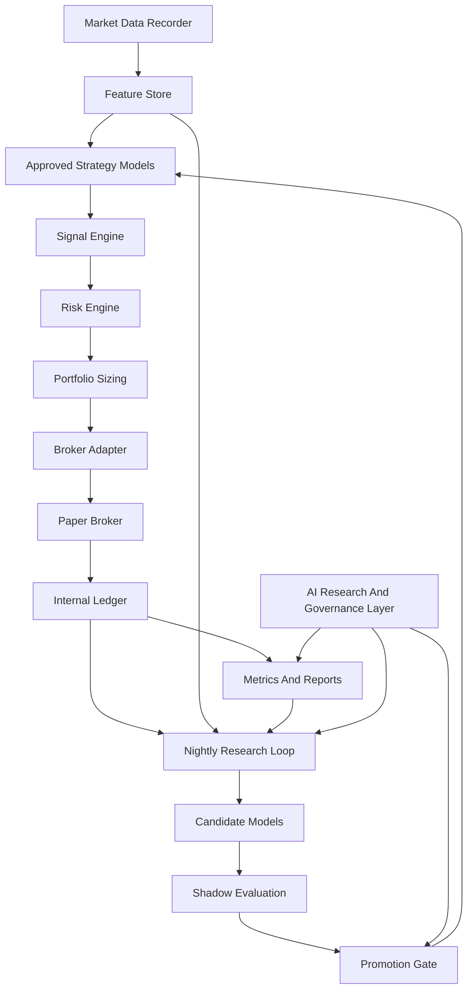

# Project Backbone Recommendation

Last updated: 2026-05-30

## Executive Recommendation

Build this project as a systematic trading research platform with an AI-assisted research and governance layer.

The core trading decisions should come from explicit, versioned models with hypotheses, risk limits, logs, and reproducible evidence. AI should help research, summarize, classify, explain, monitor, and propose improvements. AI should not initially receive unrestricted authority to place trades or rewrite active strategies.

The guiding phrase for the system is:

> Algorithms trade. AI researches, explains, audits, and improves.

This is the strongest backbone because it gives us the upside of AI without letting an unpredictable agent become the risk engine.

## Project Scope

This project should remain inside the existing scope:

- U.S.-listed stocks.
- U.S.-listed ETFs for benchmarks, sector exposure, and safer first experiments.
- Paper trading before live money.
- Real prices and real market timing.
- No non-U.S. markets.
- No crypto, futures, forex, or options in the first build.
- No live-money execution until the platform has strong evidence, risk controls, auditability, and manual approval.

## The Key Design Choice

The app should be always on, but it should not always be trading.

Always on means:

- Recording market data.
- Monitoring paper positions.
- Updating risk state.
- Capturing broker events.
- Running scheduled strategies.
- Producing daily reports.
- Running nightly research jobs.
- Detecting model drift.
- Keeping an audit trail.

Always on does not mean:

- Chasing every price movement.
- Day trading by default.
- Letting AI freely decide trades.
- Retuning live models every night without validation.
- Promoting new models because of one good day.

The best early edge is not speed. It is discipline.

## Two-Loop Architecture

The system should have two separate loops:

1. The trading loop.
2. The learning loop.

The trading loop is stable, controlled, and conservative. It runs approved model versions only.

The learning loop is exploratory. It studies results, trains candidate models, compares variants, and proposes improvements.

These loops should communicate through a model registry and promotion process, not through ad hoc changes to live strategy code.

## Backbone Components

### 1. Market Data Recorder

Purpose: continuously collect real U.S. market data with timestamps and provenance.

Responsibilities:

- Fetch historical bars.
- Stream live trades, quotes, and bars.
- Store raw and normalized market events.
- Record data source, feed type, and ingestion time.
- Distinguish IEX-only, SIP, delayed, and other data sources.
- Mark regular, pre-market, after-hours, and overnight sessions.
- Detect missing, duplicate, stale, or out-of-order events.

Why this matters: bad market data creates fake model performance. The recorder is the foundation for every backtest, paper trade, and future funding decision.

### 2. Data Quality And Provenance Layer

Purpose: make every model result traceable.

Every stored market event should record:

- Symbol.
- Event type.
- Event timestamp.
- Ingestion timestamp.
- Feed source.
- Vendor.
- Adjustment status.
- Session.
- Raw payload reference when practical.

Every experiment should record:

- Data source.
- Feed type.
- Date range.
- Symbol universe.
- Feature version.
- Strategy version.
- Costs and slippage assumptions.
- Risk settings.
- Benchmark.

If we cannot reproduce a model result, we should not trust it.

### 3. Feature Store

Purpose: convert raw data into repeatable model inputs.

Initial features:

- Daily returns.
- Rolling returns.
- Rolling volatility.
- Moving averages.
- Relative strength rankings.
- Volume trends.
- Drawdown.
- Sector classification.
- Market regime features.
- Benchmark-relative strength.

Later features:

- Fundamentals.
- Earnings dates and surprises.
- Analyst revisions.
- SEC filing features.
- Financial news features.
- AI-generated event labels.
- Earnings-call tone and guidance labels.

Feature rule: every feature must be timestamp-safe. A model should only see information that would have been known at the decision time.

### 4. Strategy Model Layer

Purpose: generate signals from explicit hypotheses.

A strategy should not directly place orders. A strategy should emit signals.

Signal examples:

- Buy candidate.
- Sell candidate.
- Reduce exposure.
- Increase exposure.
- Hold.
- Exit position.

Each strategy should define:

- Hypothesis.
- Universe.
- Required data.
- Trading horizon.
- Signal cadence.
- Position sizing suggestion.
- Exit logic.
- Failure mode.
- Benchmark.
- Risk assumptions.

### 5. Signal Engine

Purpose: run approved strategies on schedule and produce structured signals.

The signal engine should:

- Run strategies at defined times.
- Validate inputs.
- Produce deterministic outputs where possible.
- Log every signal, including "no action" decisions.
- Store signal explanations.
- Prevent strategies from calling broker APIs directly.

### 6. Risk Engine

Purpose: decide whether a signal is allowed to become an order.

Minimum risk gates:

- U.S.-only tradable universe.
- Symbol allowlist.
- Symbol blocklist.
- Max position size per symbol.
- Max portfolio allocation per symbol.
- Max sector exposure.
- Max strategy allocation.
- Max daily loss.
- Max drawdown.
- Max turnover.
- Max orders per day.
- Market-hours rules.
- Minimum liquidity.
- Minimum price.
- Cash availability.
- No margin unless explicitly approved later.
- Kill switch.

Every rejected signal should record the exact rule that rejected it.

### 7. Portfolio Construction And Position Sizing

Purpose: translate approved signals into target positions.

This layer should decide:

- How much capital each model receives.
- How much each symbol receives.
- Whether positions are equal-weighted, volatility-scaled, or risk-parity-like.
- Whether exposure should be reduced because of market regime.
- Whether correlated models are overcrowding the same trade.

Initial recommendation:

- Use simple equal-weight or volatility-adjusted sizing.
- Cap individual positions tightly.
- Cap each strategy's paper allocation.
- Avoid leverage.
- Keep cash buffer.

Complex portfolio optimization can come later. Early complexity can hide mistakes.

### 8. Broker Adapter

Purpose: isolate broker-specific APIs from the rest of the system.

The first adapter should be Alpaca paper trading.

The app should define project-owned interfaces for:

- Submit order.
- Cancel order.
- Get order status.
- Get account state.
- Get positions.
- Stream fills.
- Stream broker events.

Alpaca objects should be translated into our internal schemas at the boundary.

Future live broker adapters should plug into the same interface, but only after the system is mature.

### 9. Internal Ledger

Purpose: provide the source of truth for research and auditability.

The ledger should record:

- Orders.
- Order status changes.
- Fills.
- Partial fills.
- Cancellations.
- Rejections.
- Cash movements.
- Positions.
- Realized and unrealized P&L.
- Fees and estimated costs.
- Broker reconciliation results.

The internal ledger should not blindly trust broker-reported state. It should reconcile against broker state and surface differences.

### 10. Backtesting And Replay Engine

Purpose: test strategies against historical events using the same interfaces as paper trading.

The replay engine should process events in timestamp order:

1. Market event arrives.
2. Strategy updates state.
3. Strategy emits signal.
4. Risk engine approves or rejects.
5. Portfolio layer sizes the order.
6. Fill model simulates execution.
7. Ledger records the result.
8. Metrics update.

Important rule: do not rely on candle-only backtests for execution claims. Daily bars are acceptable for early research, but serious execution testing needs quotes, trades, conservative fill assumptions, and slippage modeling.

### 11. Experiment Registry

Purpose: make research cumulative instead of chaotic.

Every run should create an experiment record.

Record:

- Strategy name.
- Strategy version.
- Hypothesis.
- Code version.
- Data feed.
- Data date range.
- Symbol universe.
- Parameters.
- Random seed.
- Starting cash.
- Costs.
- Slippage.
- Risk settings.
- Benchmark.
- Metrics.
- Notes.
- Failure reason, if any.

Do not delete failed experiments. Failed experiments are part of the knowledge base.

### 12. Model Registry

Purpose: control which models are allowed to trade.

Suggested model states:

- `idea`: written hypothesis only.
- `backtest`: implemented and tested on historical data.
- `validated`: passed out-of-sample and robustness checks.
- `shadow`: runs live without placing orders.
- `paper`: places fake-money trades.
- `candidate_live`: eligible for manual review.
- `live_limited`: tiny real-money allocation with manual approval.
- `live_scaled`: larger allocation after long evidence period.
- `paused`: temporarily disabled.
- `retired`: no longer used.

Model versions should be immutable. If a model changes, it becomes a new version.

### 13. AI Research And Governance Layer

Purpose: use AI where it is strong without letting it become an unchecked trader.

AI should help with:

- Summarizing daily performance.
- Explaining why strategies traded.
- Reviewing rejected signals.
- Classifying news and filings.
- Extracting structured features from text.
- Detecting unusual behavior.
- Comparing model versions.
- Generating candidate hypotheses.
- Writing postmortems.
- Finding data-quality issues.
- Producing daily and weekly research memos.

AI should not initially:

- Place trades directly.
- Override risk limits.
- Change live strategy parameters automatically.
- Promote models without validation.
- Trade based only on chat-style reasoning.
- Use unverified social media as a primary signal.

AI outputs should be treated as proposed evidence, not truth.

### 14. Operations Dashboard

Purpose: make the system understandable and controllable.

The dashboard should show:

- Current paper portfolio.
- Cash.
- Positions.
- Open orders.
- Recent fills.
- Active models.
- Model performance.
- Risk status.
- Rejected signals.
- Data feed status.
- Broker reconciliation status.
- Kill switch state.
- Daily report.

The dashboard should come after the core engine. It should help operate the system, not become the system.

## Recommended Trading Approaches

### First Wave: Simple, Transparent, Lower-Turnover Models

These should be the first paper-trading models.

| Model | Horizon | Trade cadence | Why start here |
| --- | --- | --- | --- |
| U.S. sector ETF momentum | Weeks to months | Weekly or monthly | Liquid, simple, lower single-stock risk |
| Broad ETF mean reversion | Days to weeks | Daily checks, infrequent trades | Good way to study oversold bounces with less single-name risk |
| Large-cap stock momentum with quality filter | Weeks to months | Weekly or monthly | Tests a classic signal while avoiding fragile stocks |
| Quality plus momentum composite | Months | Monthly | Blends price behavior and business quality |
| Regime-aware risk overlay | Daily to monthly | Daily checks | Reduces exposure when market risk worsens |

These models are not guaranteed to work. They are good first candidates because their hypotheses are understandable and their trading cadence is manageable.

### Second Wave: Richer Models

Add these after the first wave is stable:

- Earnings drift models.
- Fundamentals-informed ranking models.
- Analyst revision models.
- AI-assisted news classification.
- SEC filing change detection.
- Market breadth models.
- Strategy ensemble allocation.

### Third Wave: Advanced Or Higher-Risk Models

Study later, but do not start here:

- Intraday trading.
- Pairs trading.
- Statistical arbitrage.
- Options.
- Short selling.
- Margin or leverage.
- Complex ML models with many parameters.

These require better data, stronger execution modeling, and more careful risk infrastructure.

## How Often Should The System Trade?

Recommended starting answer: evaluate daily, trade less often.

The system should be on continuously, but the first models should usually trade on daily, weekly, or monthly cadences.

### Market Day Schedule

Before market open:

- Validate overnight data.
- Check active model health.
- Prepare signals that rely on prior close data.
- Check corporate actions and symbol universe changes.
- Confirm broker connection and kill switch status.

During market hours:

- Stream market data.
- Monitor paper positions.
- Monitor open orders.
- Enforce risk limits.
- Execute scheduled approved trades.
- Avoid unnecessary intraday churn.

After market close:

- Reconcile broker state against the internal ledger.
- Calculate daily P&L.
- Update metrics.
- Create daily model reports.
- Freeze the day's trading record.

Night:

- Run data-quality checks.
- Update features.
- Run backtests and walk-forward tests.
- Train candidate models.
- Compare champion and challenger models.
- Generate recommendations.
- Do not silently mutate active trading models.

Weekend:

- Run deeper research jobs.
- Review model drift.
- Review strategy hypotheses.
- Decide whether any candidate deserves promotion.

## The Daily Self-Learning Loop

The user is right that the system should learn every day. The important distinction is how it learns.

Bad self-learning:

- A model changes its own parameters nightly and trades the new version the next day.
- AI reads the news and places trades without rule-based validation.
- The system optimizes yesterday's performance and calls that learning.
- A model is promoted because it had a good week.

Good self-learning:

- The active model version stays fixed.
- Nightly jobs train candidate versions.
- Candidate versions run in shadow or paper mode.
- The system compares candidates against the current champion.
- Promotions require out-of-sample evidence and risk review.
- Every change is versioned and reversible.

### Nightly Learning Steps

1. Lock the day's trading records.
2. Validate all market and broker data.
3. Update feature datasets.
4. Recompute model metrics.
5. Detect unusual behavior or drift.
6. Run candidate model training.
7. Run walk-forward validation.
8. Stress test costs and slippage.
9. Compare candidates to champion models.
10. Generate a daily research memo.
11. Recommend actions, such as keep, watch, pause, or promote to shadow.

The system may recommend changes nightly. It should not auto-promote trading changes until we deliberately design and trust that promotion mechanism.

## Promotion Gates

A model should move slowly through stages.

### Gate 1: Hypothesis Review

Questions:

- What is the market behavior we think exists?
- Why should it exist?
- Why might it stop working?
- What data does it require?
- What is the benchmark?
- What would prove it wrong?

### Gate 2: Backtest

Requirements:

- Timestamp-safe data.
- Realistic costs.
- Slippage assumptions.
- Benchmark comparison.
- Drawdown analysis.
- Performance by year.
- Performance by market regime.
- Parameter sensitivity.

### Gate 3: Out-Of-Sample Validation

Requirements:

- Holdout period.
- Walk-forward tests.
- No tuning on final test set.
- Multiple-testing awareness.
- Degraded cost assumptions.

### Gate 4: Shadow Mode

The model runs live and emits signals, but does not place orders.

Check:

- Signal frequency.
- Data availability.
- Latency.
- Operational stability.
- Risk rejections.
- Difference between expected and actual market conditions.

### Gate 5: Paper Trading

The model places fake-money trades.

Check:

- Fill behavior.
- Slippage assumptions.
- Broker reconciliation.
- P&L.
- Drawdown.
- Turnover.
- Emotional and operational comfort.

### Gate 6: Limited Live Trial

Only after strong evidence.

Requirements:

- Manual approval.
- Tiny allocation.
- Kill switch.
- Strict max loss.
- Daily review.
- No leverage.
- No unrestricted AI authority.

## Risk Philosophy

Risk management should be a product feature, not a spreadsheet afterthought.

Important principles:

- Survival first.
- Smaller position sizes at the beginning.
- No leverage initially.
- No strategy can bypass the risk engine.
- No model should be funded because of one backtest.
- Every model needs an exit rule.
- Every model needs a failure mode.
- Every live-money step requires manual review.
- Paper trading is evidence, not proof.

## What I Would Push Back On

I would push back on:

- Starting with day trading.
- Letting AI trade directly.
- Letting models retune themselves nightly and immediately trade.
- Using only free IEX data for serious ranking.
- Trusting paper fills as if they were real fills.
- Optimizing heavily before we have stable data.
- Building a polished UI before the ledger and risk engine work.
- Funding any model before it has survived paper trading.
- Ignoring boring benchmarks like SPY.
- Treating high return as good without drawdown and risk context.

Better alternatives:

- Start with daily or weekly models.
- Use AI for research and governance first.
- Build the ledger and experiment registry early.
- Use paper trading as the first arena.
- Promote models slowly.
- Make every model explain itself.

## First Build Sequence

### Milestone 1: Core Data And Ledger

Build:

- Project schemas.
- Market event models.
- Signal models.
- Order and fill models.
- Position models.
- Internal ledger.
- Basic persistence.
- Data provenance fields.

Definition of done:

- We can store a market event.
- We can store a signal.
- We can store an order.
- We can store a fill.
- We can reconstruct cash and positions.

### Milestone 2: Historical Data And First Backtest

Build:

- Historical bar fetcher.
- Parquet storage.
- DuckDB query path.
- Simple backtest runner.
- SPY buy-and-hold benchmark.
- First sector ETF momentum model.

Definition of done:

- We can run a reproducible backtest.
- Results record data source, date range, parameters, and benchmark.
- Metrics include return, drawdown, volatility, and turnover.

### Milestone 3: Risk Engine

Build:

- Position caps.
- Portfolio caps.
- Cash checks.
- Symbol allowlist.
- Market-hours rules.
- Max orders per day.
- Kill switch.
- Rejection logging.

Definition of done:

- Strategies cannot create orders without risk approval.
- Every rejection is explainable.

### Milestone 4: Paper Trading

Build:

- Alpaca paper broker adapter.
- Broker event ingestion.
- Order status tracking.
- Fill reconciliation.
- Paper portfolio reporting.

Definition of done:

- We can submit paper orders through the adapter.
- The internal ledger reconciles against Alpaca paper state.
- We can explain every paper trade.

### Milestone 5: Daily Reports And AI Governance

Build:

- Daily model report.
- P&L report.
- Risk report.
- Rejected signal report.
- AI-generated summary based on internal data.
- Human-readable trade explanations.

Definition of done:

- Every trading day ends with a report we can review.
- AI summarizes evidence but does not invent trades.

### Milestone 6: Nightly Learning Loop

Build:

- Feature updates.
- Candidate model training.
- Walk-forward evaluation.
- Champion/challenger comparison.
- Promotion recommendations.
- Model registry states.

Definition of done:

- The system can learn nightly without altering active trading models automatically.
- Candidate models can enter shadow mode.

## First Models To Implement

### Model 1: Sector ETF Momentum

Hypothesis: U.S. sector trends can persist over intermediate horizons.

Universe:

- U.S. sector ETFs.

Cadence:

- Weekly or monthly.

Signal:

- Rank sectors by trailing returns.
- Hold top-ranked sectors.
- Compare to SPY.

Why first:

- Simple.
- Liquid.
- Easy to explain.
- Lower single-stock risk.

### Model 2: ETF Mean Reversion

Hypothesis: liquid U.S. ETFs sometimes overreact in the short term and partially revert.

Universe:

- Broad, liquid U.S. ETFs.

Cadence:

- Daily evaluation.
- Trades only when oversold conditions are met.

Signal:

- Buy after large downside move if broader trend and liquidity checks pass.
- Exit after fixed time, target, stop, or signal normalization.

Why second:

- Tests a different behavior than momentum.
- Keeps single-company news risk lower.

### Model 3: Large-Cap Momentum With Quality Filter

Hypothesis: strong momentum works better when fragile companies are filtered out.

Universe:

- Liquid U.S. large-cap stocks.

Cadence:

- Weekly or monthly.

Signal:

- Rank by intermediate-term momentum.
- Exclude weak quality names.
- Cap sector and symbol exposure.

Why third:

- Moves from ETFs to stocks with guardrails.

### Model 4: Quality Plus Momentum Composite

Hypothesis: combining business quality and price momentum can produce better risk-adjusted returns than either alone.

Universe:

- Liquid U.S. stocks with available fundamentals.

Cadence:

- Monthly.

Signal:

- Composite score from quality, profitability, balance-sheet strength, and momentum.

Why fourth:

- Adds fundamentals after the price-data pipeline works.

### Model 5: Regime Risk Overlay

Hypothesis: reducing exposure during high-risk regimes can reduce drawdowns.

Universe:

- Portfolio-level overlay.

Cadence:

- Daily.

Signal:

- Risk-on, neutral, or risk-off based on trend, volatility, and breadth.

Why fifth:

- It protects the whole system rather than searching for standalone alpha.

## AI Model Usage Roadmap

### Phase 1: AI As Analyst

Use AI to:

- Summarize results.
- Explain trades.
- Write daily memos.
- Spot suspicious data.
- Compare strategies.

### Phase 2: AI As Feature Creator

Use AI to:

- Classify news.
- Summarize SEC filings.
- Extract earnings-call sentiment.
- Detect management tone changes.
- Produce structured event labels.

Every AI-generated feature should store:

- Source document.
- Timestamp.
- Prompt or extraction method version.
- Model used.
- Confidence or review status.
- Output schema.

### Phase 3: AI As Research Partner

Use AI to:

- Propose hypotheses.
- Suggest parameter ranges.
- Identify failure modes.
- Draft postmortems.
- Recommend model retirement or promotion.

### Phase 4: AI As Constrained Operator

Only much later, consider allowing AI to operate within tightly bounded workflows:

- It may request a model pause.
- It may request a manual review.
- It may propose a rebalance.
- It may never bypass risk limits.
- It may never move live money without explicit approved permissions.

## Benchmarks

Every model should be compared against simple alternatives.

Initial benchmarks:

- SPY buy-and-hold.
- Equal-weight sector ETF portfolio.
- Cash or Treasury bill proxy.
- Equal-weight selected universe.
- Previous model version.

If a complex model cannot beat a simple benchmark after costs and risk adjustment, it is probably not worth promoting.

## Trading Costs And Tax Awareness

Fees, slippage, spread, and taxes must be modeled before we trust strategy rankings.

Every model should report:

- Gross return.
- Return after explicit trading fees.
- Return after estimated spread and slippage.
- Return after estimated taxable impact, when the account is taxable.
- Turnover.
- Average holding period.
- Percent of gains likely to be short-term versus long-term.

The ledger should track exact fills and explicit fees. A later tax-lot module should estimate taxable effects separately from the ledger because tax treatment depends on account type, filing context, state taxes, other income, loss carryovers, wash-sale interactions, and trades outside this app.

Minimum cost assumptions:

- Broker commissions, even if expected to be zero.
- Regulatory and activity fees that may be passed through on sales.
- Bid-ask spread.
- Slippage.
- Borrow costs if shorting is ever approved later.
- Margin interest if margin is ever approved later.
- Market data and infrastructure costs as research overhead.

Minimum tax assumptions:

- Distinguish short-term and long-term realized gains.
- Track tax lots for future realized-gain estimates.
- Flag potential wash-sale situations.
- Report pre-tax and estimated after-tax performance separately.
- Penalize high-turnover models when taxable drag is likely to be high.

Taxes should not be used as an excuse to avoid trading when a model has a strong edge, but a strategy that only works before costs and taxes should not be promoted.

## Metrics That Matter

Return:

- Total return.
- Annualized return.
- Excess return versus benchmark.
- Return after trading costs.
- Estimated return after taxes.

Risk:

- Maximum drawdown.
- Volatility.
- Downside volatility.
- Tail loss.
- Time under water.

Quality:

- Sharpe ratio.
- Sortino ratio.
- Calmar ratio.
- Win rate.
- Average win/loss.

Behavior:

- Turnover.
- Number of trades.
- Average holding period.
- Exposure by symbol.
- Exposure by sector.
- Correlation to benchmark.
- Correlation to other models.

Robustness:

- Out-of-sample performance.
- Walk-forward performance.
- Performance by market regime.
- Sensitivity to costs.
- Sensitivity to parameters.
- Stability across time.

## Final Recommendation

The best backbone is not a single trading algorithm and not a fully autonomous AI trader.

The best backbone is a controlled research and trading system:

- Always-on data and risk monitoring.
- Versioned strategies.
- Explicit hypotheses.
- Paper trading with real prices.
- Internal ledger as source of truth.
- AI-assisted research and governance.
- Nightly learning without uncontrolled mutation.
- Slow model promotion.
- U.S.-only scope.
- Small, manual, limited live trials only after strong evidence.

This gives us room to build something genuinely powerful without pretending markets are easy.

## Reference Sources

- [SEC: Day Trading: Your Dollars at Risk](https://www.sec.gov/about/reports-publications/investor-publications/day-trading-your-dollars-at-risk)
- [Investor.gov: Artificial Intelligence and Investment Fraud](https://www.investor.gov/index.php/introduction-investing/general-resources/news-alerts/alerts-bulletins/investor-alerts/artificial-intelligence-fraud)
- [Gu, Kelly, and Xiu: Empirical Asset Pricing via Machine Learning](https://academic.oup.com/rfs/article/33/5/2223/5758276)
- [Bailey and Lopez de Prado: The Deflated Sharpe Ratio](https://www.davidhbailey.com/dhbpapers/deflated-sharpe.pdf)
- [Alpaca: Paper Trading](https://docs.alpaca.markets/v1.4.2/docs/paper-trading)
- [Alpaca: Historical Stock Data Feeds](https://docs.alpaca.markets/us/docs/historical-stock-data-1)
- [IRS: Topic No. 409, Capital Gains and Losses](https://www.irs.gov/taxtopics/tc409)
- [IRS: Publication 550, Investment Income and Expenses](https://www.irs.gov/publications/p550)
- [FINRA: Trading Activity Fee](https://www.finra.org/rules-guidance/guidance/faqs/trading-activity-fee)
- [SEC: Fee Rate Advisories](https://www.sec.gov/rules-regulations/fee-rate-advisories)
